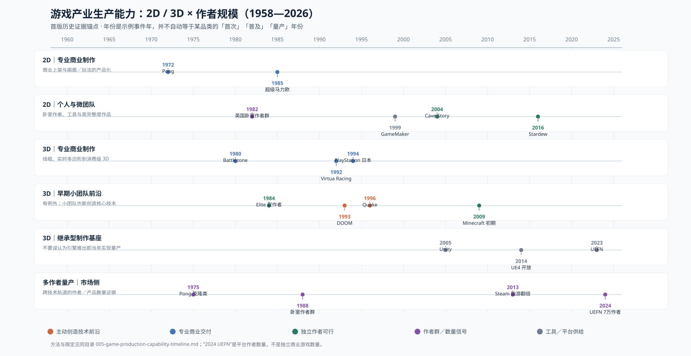

# 005 — 游戏产业技术—产品生产能力年代表（1958—2026，首版）

> **当前优先入口（2026-10-11实质纠错）：**[025 — 对代表作年份、个人制作能力、联网与类型漏项的反向审计](025-flagship-era-audit-earlier-small-authors-and-missing-genres.md)｜[新12类×大型／中型／微型时代图SVG](025-audited-era-by-genre-three-rails.svg)｜[82条逐案例来源](023-representative-genre-three-rails-1958-2026.csv)。相较023九类图的65条，新增17条早期/缺漏作品，**12类×3轨已有33/36选样角色；赛车、RTS、RPG三类M核心仍缺明确团队FTE证据**。原023/024的27/27只是旧选样宽度，非全产业完整。

> **当前优先阅读：**[023 — 1958—2026游戏分品类L/M/I三条线的标志性历史作品总览](023-first-readable-historical-three-line-atlas.md)｜[可直接观看的主图SVG](023-representative-three-rails-filled-first-pass.svg)｜[65条来源可追的里程碑记录](023-representative-genre-three-rails-1958-2026.csv)。[022](022-network-conditioned-genre-three-line-method.md)的102格是科研审计辅助，不是主图完工条件；现主图9家族×3轨，有27/27已有案例锚点。联网以S/C/N/O/D/∞模式注释，工具和不同子品类合作列附轨。

> **研究入口已纠偏：**[022 — 玩法 × 2D/3D × 网络架构 × 持久性 × 制作主体的严格三线分代](022-network-conditioned-genre-three-line-method.md)。[完整102格分类矩阵SVG](022-genre-network-lmi-matrix.svg)｜[按21个实证单元绘制的大／中／微三轨时间轴SVG](022-network-conditioned-three-rail-timeline.svg)｜[逐版本30条案例CSV](022-version-specific-lmi-evidence.csv)。此前[021旧图](021-three-track-genre-production-capability.md)因混合网络形态和不等价玩法，已标为历史草稿。

> **核心主线（优先读）：[021 — 不同品类中大型专业 L／中型核心 M／个人微型 I 的三条生产能力时间线](021-three-track-genre-production-capability.md)** · [十品类三线SVG时间轴](021-genre-three-production-lines.svg) · [24个有出处的L/M/I案例CSV](021-genre-lmi-three-line-anchor-evidence.csv)。此前005—020大量作者群、Steam、ZXDB、UGC资料改作验证这些年份的附属证据，而不再充当三条线本身。空格写UNKNOWN，不能捏造连贯扩散年份。

> **新增真实数量级证据：**[020 — 1982—1992 ZX Spectrum 11年有来源的作品与去重个人署名人数曲线](020-zxdb-1982-1992-measured-supply-and-genre.md)。1984年 **1,386条原始独立发行游戏/913名明确个人署名人**；注意这不是独立商业工作室数量，也不是整个游戏行业分母。[SVG](020-zxdb-1982-1992-six-panel-author-supply.svg)。

- Status: **WORKING BASELINE / 不得当作完整量产统计**
- As-of: 2026-10-09
- Canonical owner: Industrial Revolutions Comparative Lab，承接 [001 技术吸收框架](001-technology-absorption-framework.md) 与 [003 游戏产业技术体制](003-game-industry-technology-regimes.md)
- Visual: [单独打开 SVG 时间图](005-game-production-capability-timeline.svg)

- Boundary: 公开游戏产业史；不引入私人游戏项目设计和组织资料。

> **第二轮细化 2026-10-10：**已增加 [008—8轨产品能力年代图+前Steam/Steam分母图+2D/3D射击对照](008-audited-genre-capability-atlas.md)。1958—2026事件稀疏数据不代表缺乏作品；四级组织量产曲线不应伪造。

## 0. 本研究真正要画什么

**不是把 8-bit→16-bit→3D→AI 画成一条“先进程度曲线”。** 要求是：从游戏业诞生以来，在明确年份记录「大型／中型／独立」的作者，针对 **2D 与 3D 在生产难度上可比的品类**，何时：
1. **F / Frontier demonstration**：存在功能明确的技术／可玩演示；
2. **P / Professional reproducibility**：专业制作方能商业化重复交付，不依赖一次性奇迹；
3. **M / Mid-size viability**：中型团队能以常规商业资金负担同档产品；
4. **I / Indie viability**：个人／微团队取得可重复制作所需工具和发行接口；
5. **Q / Multi-author quantity production**：多个相互独立作者群能稳定出货，留存分母、年份、作者去重方法，不能用一款成功游戏代替规模；
6. **D / Direct market feedback**：可持续上线、收费、接收反馈并迭代。

不同阶段可能重叠甚至顺序倒置；同一作品可 P 与 I 同年，例如 1984《Elite》；更不能把现代 AAA 定义倒套给 1972 年 Atari。

本页先提供**有日期的锚点**，未知格保留 UNKNOWN。后续按年度、品类、作者样本把可行区间升级为统计结论。

## 1. 两种坐标：技术形态 ≠ 生产难度

| 生产问题 / 功能层（非算力等级） | 2D 作品候选 | 3D 作品候选 | 为什么只是“可比较的问题”，不是“成本相等” |
|---|---|---|---|
| C0 单场景：基础输入、实时交互、碰撞 | 《Pong》1972 | 《Battlezone》1980（线框） | 同为局部交互；3D 投影、坐标和显示硬件难度不同 |
| C1 多关卡可导航动作 | 《Super Mario Bros.》1985 | 《Wolfenstein 3D》1992（受限伪 3D） | 2D 滚屏与 raycasting 的结构不同；不能据此声称渲染难度相近 |
| C2 多区域关卡＋动画＋关卡编辑 | 1990s 2D 动作／RPG | 1990s 多边形 3D 动作；《Quake》1996 | 共享关卡、敌人、摄像机、动作流水线需求；需要再按资产密度对齐 |
| C3 大世界＋持久状态＋系统交互 | 2D RPG／策略／沙盒；《Terraria》2011 | 《Elite》1984（早期有限型）；《Minecraft》2009（初期版本） | 系统规模与内容量不是画面维度；两部 3D 作品的技术层级也不同 |
| C4 多人规则＋服务器／UGC | 2D 联机生存／多人沙盒 | 《Counter-Strike》MOD 1999、《DayZ》MOD 2012、UEFN | 网络／平台是新的独立约束；MOD 不等于 standalone |
| C5 大规模高规格资产与运维 | 高强度手绘／动画／关卡生产 | 高密度 3D 资产／演出／开放世界／在线服务 | 可能 2D 比某些 3D 更昂贵。禁止“一律 3D 比 2D 难／先进” |

**准则**：每个项目还须填写六维负担向量 `[renderer/toolchain, content/art, systems, networking, platform/QA, market/distribution]`；复杂度只允许在同一年份、同一目标平台、相似目标品质、相似生产范围内比较。要把技术难度和工作量分开。

## 2. 有来源的年代节点（首版，非全量）

| 年份 | 路线／技术—品类 | 大型／中型／独立的可行性或扩散 | 本次确认的证据与限制 |
|---|---|---|---|
| **1958** | 基于模拟计算机的《Tennis for Two》互动显示 | F：实验室；不可当产业化 | [CHM](https://www.computerhistory.org/timeline/graphics-games/) |
| **1962** | 《Spacewar!》交互太空战 | F：大学／技术爱好者，早期技术社区复制 | [CHM PDP-1](https://www.computerhistory.org/pdp-1/spacewar/) |
| **1971–1972** | 街机《Computer Space》《Pong》，单屏动作商业化 | P：早期创业公司；尚不存在现代大型／中型／独立的稳定分层 | [Smithsonian](https://www.si.edu/spotlight/the-father-of-the-video-game-the-ralph-baer-prototypes-and-electronic-games/video-game-history) |
| **1975–1977** | 家用 Pong 类、卡带式主机 | Q 候选：同类家用主机／变体多家公司生产；不是对独立作品数量的统计 | [Smithsonian](https://americanhistory.si.edu/blog/2012/04/pong-atari-and-the-origins-of-the-home-video-game.html) |
| **1980** | 《Battlezone》：专业街机线框 3D 战车 | P：高专用硬件技术环境已能商业化 3D；不是通用家用 3D 工具 | [Museum of the Game](https://www.arcade-museum.com/Videogame/battlezone) |
| **约 1982–1988** | 英国家用 8-bit：单作者商业 2D 游戏生产生态 | I／Q 候选：卧室程序员群体，必要补同期出版物作者数和出货分母 | [1980s contextual study](https://code198x.com/vault/phenomena/bedroom-coder/)（二手，待来源升级） |
| **1984** | 《Elite》：线框 3D＋交易、探索、状态系统 | **I 的反例锚点**：Ian Bell、David Braben 双作者，绝非“3D 等到 2005 年才可独立制作” | [BBC Micro archive](https://www.bbcmicro.co.uk/game.php?id=366) |
| **1985** | 《Super Mario Bros.》卷轴平台动作 | P：成熟主机公司掌握高效 2D 表现与关卡生产；单作不是 Q | [Nintendo 日本首发日期](https://www.nintendo.com/jp/character/mario/en/history/smb/index.html)（开发团队规模仍需再核） |
| **1992–1994** | 世嘉《Virtua Racing》1992（商业 3D 多边形）、PlayStation 日本 1994 | P：专业级实时多边形内容产品与消费硬件平台扩散 | [SEGA corporate history](https://www.sega.jp/history/arcade/topics/6512/index.html)、[CHM](https://www.computerhistory.org/timeline/graphics-games/) |
| **1993–1996** | 《DOOM》1993：受限 3D＋WAD；《Quake》1996：实时多边形 FPS | 小型专业团队创建技术窗口，并开放地图／MOD 作者生态；不能等同一般独立作者可做整个 FPS 工程 | [CHM](https://www.computerhistory.org/timeline/graphics-games/)、[Quake official file archive](https://github.com/Jason2Brownlee/QuakeOfficialArchive) |
| **1999** | GameMaker 开始；2D 作者工具进入现代降低门槛进程 | I：编辑器可得，不意味着当年所有类别已量产 | [GameMaker official 25th anniversary](https://gamemaker.io/en/blog/gamemaker-25) |
| **2000年代初** | RPG Maker 2000／2003 作者生态、WAD／MOD 后续 | Q 研究候选：可从独立作者作品库构建逐年群体，而非单作里程碑 | [RPGMaker Archive](https://www.rpgmakerarchive.com/)（幸存归档，不等于全体） |
| **2004** | 《Cave Story》：高完整度单作者 2D 银河城 | I 强案例；**不是“2004 年才首次出现单人 2D 游戏”** | [GameSpot 传记回顾](https://www.gamespot.com/gallery/the-14-best-games-developed-by-only-one-person/2900-2172/) |
| **2005** | Unity 正式推出，可复用 3D 引擎进入微团队工具供给 | I 的技术供应侧；需要单独核算实际采用年份及 3D 出货 | [Unity 2011 corporate retrospective](https://unity.com/news/unity-technologies-celebrates-six-years-continual-leadership-and-innovation) |
| **2009–2013** | 3D 沙盒／2D 独游；公开 alpha、玩家验证、数字分发 | I／D：工具+社区+付费测试；《Minecraft》初期 2009 值得独立核验 | [Steam official 2013 early access launch](https://store.steampowered.com/oldnews/?enddate=1388563200&feed=steam_press) |
| **2012–2013** | Steam Greenlight 2012、Early Access 2013 | D／Q 的市场层面改变：Valve 报告 Greenlight 首年 Steam 独立游戏数量翻倍；不是整个业界的 2D/3D 技术升级 | [Valve 2013 press](https://store.steampowered.com/oldnews/?enddate=1388563200&feed=steam_press) |
| **2014** | UE4 对小团队开放订阅；Godot 首次公开发布 | I：3D／2D 通用工具获取门槛下降，量产需观察后续多年 | [Epic](https://www.unrealengine.com/blog/epic-games-releases-unreal-engine-4-for-all)、[Godot](https://godotengine.org/article/first-public-release/) |
| **2017** | Steam Direct，上架门槛结构变化 | D／Q：不能把作品数量增长全部归因引擎进步 | [Valve](https://store.steampowered.com/news/posts/?enddate=1496780339) |
| **2018 / 2023** | Fortnite Creative / UEFN | I／D：大型既有产品成为他人免费试验场及触达玩家的基础设施 | [Epic 2018](https://www.fortnite.com/news/creative)、[Epic 2023](https://www.fortnite.com/news/unreal-editor-for-fortnite-and-creator-economy-2-0-are-here-new-worlds-await) |
| **2024** | UEFN／Creative 3D 作者生产平台 | **Q 平台级强证据**：Epic 报告 70,000 creators、198,000 published islands，其中 137,000 UEFN；不等于 70,000 款独立 3D 商业游戏 | [Epic 2024 year in review](https://www.fortnite.com/news/fortnite-ecosystem-2024-year-in-review-celebrating-creators-and-looking-ahead) |
| **2022–2026** | 生成式／Agentic 工具进入制作 | F/P/I 时钟未同步、具体品类的 Q 尚不能确认；拒绝把 demo 当量产 | 本文仅列待审计问题，不给确定量产元年 |

## 3. 面向“大型／中型／独立”的首次分层：仅做已有证据支持的判断

| 历史区间 | 高资金／专业平台层 | 中型专业制作层 | 个人／独立作者层 | 当时真正容易重复的品类 |
|---|---|---|---|---|
| 1971–1979 | 商业街机、家用专用机与芯片 | 尚须按各游戏实际团队重新定义 | 个人程序员有但不可称统一商业“独游”层 | 单屏动作／街机逻辑；Pong 家用变体逐渐复制 |
| 1980–1989 | 专用街机 3D、主机品牌 2D | 家用机工作室和商业发行形成不同规模链条，量级未审 | 8-bit 卧室作者商业出货；1984 双作者 3D《Elite》 | 2D 动作／冒险／策略；极简 3D 例外 |
| 1990–1999 | 3D 街机／PS 系多边形、2D 主机精品 | FPS 引擎、3D 关卡、RTS、动作／RPG 中型开发者可达但需个案人数 | Doom WAD／Quake MOD、GameMaker 1999 低门槛工具 | 2D 游戏和 MOD 内容供给；完整 3D 产品仍有更大工程门槛 |
| 2000–2009 | 3D 大世界、联网与大量资产成为专业资本重镇 | 引擎许可、资源生产分工逐步成熟 | RPG Maker／Flash／GameMaker 社区；2005 Unity，2009 Minecraft alpha | 2D 作者生态成熟，受限 3D 原型有突破 |
| 2010–2019 | HD 高成本内容、在线平台／运营 | 商用／开源引擎大幅削减造轮子需求 | 2D 高完成度、3D 中小规格和玩家早测扩张 | 2D/3D 多种成熟类型；类型内部供给量尚待分母化 |
| 2020–2026 | 高保真内容及复杂服务仍高成本 | 工具服务化／远程协作提高技术上限 | 3D co-op、UGC、UEFN、AI 辅助；商业获客不保证低成本 | UGC 平台量产有可计数证据；独立 standalone 分品类 Q 未普查 |

**重要**：大型／中型／独立不是按每个时代固定人员数标记。须登记“核心全职人数／峰值／外包／预算／团队是否独立决策／技术是否自研”分别，缺项 UNKNOWN；大型发行商支持的小团队不能偷换成“独立单作者”。上表是初步结构假设，不是对各年代全市场的统计。

## 4. 必须补上的「作者群体量产」计数层

以下是**不同分母**，不可在同一曲线上伪装成“某品类作者人数”：

| 观测样本 | 2012 | 2014 | 2017 | 2024 | 2025 | 含义／限制 |
|---|---:|---:|---:|---:|---:|---|
| SteamDB 全平台每年游戏发行 | 303 | 1,712 | 6,925 | 18,450 | 21,261（动态快照） | **总游戏数量**，不能推出全是 indie、独立作者数或引擎起效年份 |
| SteamDB「3D Platformer」标签每年游戏数 | 4 | 22 | 104 | 1,374 | 1,479 | 标签有追标、重叠、历史覆盖不等问题；可提示品类作品供给扩张，不能证明 2017 才开始量产 |
| Fortnite Creative+UEFN 作者／发布岛屿 | — | — | — | **70,000 creators／198,000 islands** | — | 创作者人数和作品数分开；2024 137,000 islands via UEFN |

SteamDB 动态页面：[all releases](https://steamdb.info/stats/releases/)、[3D Platformer](https://steamdb.info/stats/releases/?tagid=5395)。2025 是截至 2026-10-09 查询时网页快照所展示的历史年度结果；本轮复核发现旧快照 2024 年 3D Platformer 曾显示 1,355 款、这次显示 1,374 款，不能将标签追标当新增历史发行，日后回访可能有小幅变化；**2026 当年数据不入年度比较**。

下一阶段 Q 的严格定义建议：
- **Q1 可见作者群**：同类型、同年度至少 20 个可辨别的独立作者／开发主体有可玩作品；只作研究筛选阈值，不是行业普遍法则；
- **Q2 连续生产**：连续三年 Q1 成立，至少有新进入者，不是几个高产账号刷出作品；
- **Q3 商业量产**：另证实定价、发行、收入或可持续组织，而非仅发布大量免费地图／jam 作品；
- 同时记录未发售／取消／失败样本，避免把“被发现”当“能生产”、把“发售”当“能盈利”。

## 5. 三个容易把整本书带歪的历史反例

1. **1984 Elite：早期就有双作者 3D 商业游戏。** 无法把 3D 研发能力简单写成“90s 大厂专属→2010s 独游”。实际要按 3D 玩法／资产规格和工具负担分级。
2. **1993 DOOM：小团队的 Created Window。** 由少数高技术作者推进技术前沿，不等于当时一般小团队能以同等成本开发 FPS。制作公司规模、技术创造位置是两根轴。
3. **2024 UEFN：大规模作者生产未必对应大量独立 standalone 产品。** 平台把引擎、多人基础、发行、玩家入口捆绑，让作者可以生产体验，但产权、后端依赖、迁移成本、商业回报仍另算。

## 5.5 逐年数据与四生产主体分代分析（第二轮进度）

- [006 — 1958—2026 69 年年度观察 CSV](006-annual-production-capability-observations.csv)／[字段字典](006-annual-observations-dictionary.md)：Steam 2D/3D 可直接对照的逐年数量，GGJ 与 UGC 的独立作者生态分母；空白是 UNKNOWN，不是零。
- [007 — 同品类 2D/3D × 大厂／中厂／独立／作者量产的阶段审计](007-genre-production-diffusion.md)：对比 1983 Manic Miner、1984 Elite、1996 Super Mario 64、2017 A Hat in Time、2020 Pumpkin Jack、2024 UEFN 的生产尺度，附两张 SVG 图；**M 核心中等规模已有 1991 Sonic（5→7）、1996 Crash（8）、1998 Spyro（内部署名13）案例；但中型项目的全行业量产年份仍缺跨主体分母。**

## 6. 接下来的统计缺口，按优先级

1. **2D／3D 品类的可比较难度**：固定屏幕、卷轴、关卡动作、RPG/策略、开放式系统、联网射击、co-op 生存、UGC，逐年补实际编辑器／SDK／引擎与制作强度。
2. **三个组织层的年代产能**：按核心开发人数、年度人月、外包、预算独立统计（优先 GDC / MobyGames credits / 商业档案），不拿孤例代表全产业数量级。
3. **多作者量产的滞后期**：按平台／品类／地区建作者去重 cohort，查 FIRST→I→Q 的年份差，补失败者分母。
4. **MOD→standalone 的开发路径**：逐个核验 DOOM WAD、Counter-Strike、Dota、Arma / DayZ / PUBG、Roblox、UEFN，从可玩的 MOD 和赚钱的 standalone 之间分开计算。
5. **引擎降低难度 vs 市场分发降低门槛**：分离 1999 GameMaker、2005 Unity、2012–13 Steam、2014 UE4/Godot、2017 Steam Direct、2023 UEFN 的不同机制。
6. **时代和国别差异**：同一品类技术能否跨过美国、欧洲、日本、俄罗斯、中国的作者可得性与组织规则门槛。

**禁止推论**：一个例子≠行业普及；若无总量／分母不可推数量级；后发生者的选择不能脱离其时代已有工具；2D≠低成本、3D≠高成本；UGC 内容≠商业 standalone；引擎发表年份≠普通作者能量产年份。

