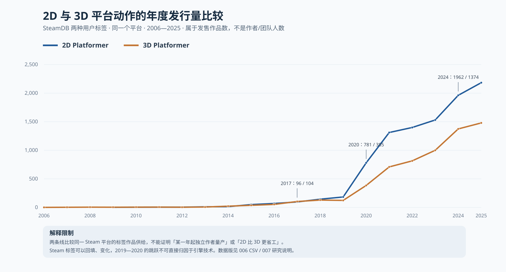
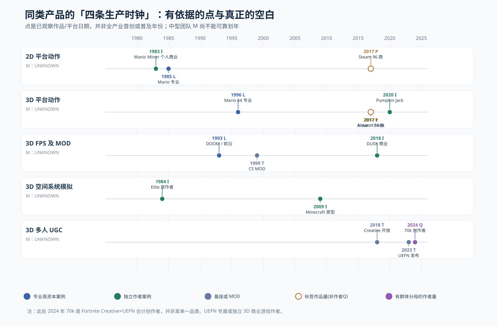

# 007 — 2D／3D 同品类产品分代：大厂、中厂、独立作者、量产证据（1958—2026）

- Status: **AUDITED WORKING MAP — 部分阶段缺数据，不等同全产业普查**
- Updated: 2026-10-09
- Data: [006 年度原始观察 CSV](006-annual-production-capability-observations.csv)／[字段字典](006-annual-observations-dictionary.md)
- Figures: [2D vs 3D 平台动作：实际发行数量曲线](007-2d-vs-3d-platform-production.svg)；[四类生产主体：阶段时间地图](007-genre-diffusion-clock.svg)

## 1. 研究对象重定义：同一类型的“四个生产时钟”，不是硬件世代

每个 **genre × format × target-platform × target-fidelity** 组成一条独立队列。时间坐标定为：

- **L｜专业高资本／头部**：作品以专业公司／高预算组织／专用硬件等条件实现；大公司规模要另证，**不能从 Nintendo 品牌推算开发当时人数**。
- **M｜中等组织生产**：有可识别的中等规模人员／人月／预算档位，以常规商业流程稳定完成同档产品；不凭“工作室名字”作判断，未核团队数据时写 `UNKNOWN`。
- **I｜独立作者完整产品**：创作者自主主导、完成可玩的有市场接口产品；可以有签约发行／美术合作，必须另记真正核心人数。原型单独标为 `I-prototype`。
- **Q｜同品类多作者量产**：严格版必须年内有足够多**不同开发主体**，且可统计重复年份和商业/非商业边界。只观察到游戏数（`Q-product-proxy`）**不等于 Q-author-confirmed**。
- **F｜技术前沿创造** 与 **T｜工具/平台供给** 是和以上四种主体**正交的辅助时钟**，不算另一种大厂规模；MOD 出品也不得偷换 standalone。

结论不能强迫 `L<M<I<Q` 按时间先后发生。1983 单人 2D 与 1984 双人线框 3D 早于后来体量庞大的商业 2D/3D 工作室；这就是为何四条“曲线”不是一条技术阶梯的四次时间平移。

**历史名称限制**：1970s 没有今天意义的 AAA。分析保留当时组织名称，L/M/I 是研究者编码而非历史自称。收入、开发者署名、预算、可复用工具、平台进入渠道、审美保真要求彼此分开。

## 2. 2D 与 3D：按功能类问题与负担向量结对

| 配对 ID | 共通交互及制作范围（目标控制变量） | 2D 同类参照 | 3D 同类参照 | 额外难度与不能简化之处 |
|---|---|---|---|---|
| A | 关卡动作；移动、碰撞、敌人、镜头、关卡资产 | 1983 `Manic Miner`／1985 `Super Mario Bros.`，后续作者型 2D 平台动作 | 1996 `Super Mario 64`；2017 `A Hat in Time`；2020 `Pumpkin Jack` | 2D 滚屏/美术与 3D 相机/空间碰撞/动画不同；3D 作品的美术保真不可与 1980s 2D 成本等价 |
| B | 探索／经济／持久世界状态 | 2D 角色扮演、俯视角系统沙盒；2011 `Terraria` 可作后来小团队坐标 | **1984 `Elite` 双作者**；2009 `Minecraft` 早期个人原型 | 这里系统负担可能大于渲染，不能用世界面积或物体数直接比较 |
| C | 目标识别／瞄准／掩体／多关卡射击 | 2D 俯视射击；需要从 Steam 标签去重获取子品类 | 1993 `DOOM`、2018 `DUSK` 等不同画面规格 FPS | “俯视”与“第一人称”本身改变战斗信息架构；须固定体验复杂度才可谈技术替代 |
| D | 多人交互、服务器、匹配、内容持续更新 | 2D 联机、合作、策略/社交 UGC；本轮人数与年份尚缺 | 1999 `Counter-Strike` MOD、2012 `DayZ` MOD、2023 `Lethal Company` 独立商业 EA | 使用现有服务器／mod substrate 与独立开发全套联网基础设施是不同难度 |
| E | 玩家作为内容作者、编辑器、发布与发现 | RPG Maker／GameMaker、2D 用户地图 | `DOOM` WAD、Fortnite Creative、UEFN、Roblox | UGC 作者产量不等于商业 standalone 产品；还须计平台剥夺／迁移成本 |

同类比较必须另记：`render/physics`、`author-tool`、`asset-effort`、`systems`、`network`、`testing/platform`、`distribution` 七维；“低多边形”不代表关卡数、QA 或在线服务轻量。

## 3. 第一批有严格年份来源的阶段：横向可比，不伪造 M

| 队列 | L／专业头部的**可观察案例** | M／中型正式产能 | I／独立完成或公开试验 | Q／可检验量产依据 |
|---|---|---|---|---|
| 2D 平台动作 | **1985** 《Super Mario Bros.》Famicom 商业关卡产品 [Nintendo](https://www.nintendo.com/jp/character/mario/en/history/smb/index.html) | **UNKNOWN**：需逐款核实同期商业制作人数，不等同 1985 任天堂项目整体员工 | **1983** 《Manic Miner》Matthew Smith 作为小作者商业作品，ZX Spectrum [World of Spectrum](https://worldofspectrum.net/item/0003012/) | 2015 Steam 2D Platformer **50 款**；2017 **96 款**；2024 **1,962 款**；是同标签 **Q-product-proxy**，作者去重未完成 |
| 3D 平台动作 | **1996** 《Super Mario 64》Nintendo 的专业消费市场 3D 产品 [Nintendo](https://www.nintendo.com/jp/character/mario/en/history/index.html) | **UNKNOWN**；2017 `A Hat in Time` 有多人参与，却未核同期全职／外包边界，不能擅标“中厂” | **2012** `A Hat in Time` 开始 UDK 原型，2013 Kickstarter，**2017** 成品小团队；**2020** 《Pumpkin Jack》Nicolas Meyssonnier 主导的 3D 平台动作 [2013 开发者访谈](https://www.cubed3.com/features/interviews/gears-for-breakfast-talk-a-hat-in-time)／[Kickstarter](https://www.kickstarter.com/projects/jonaskaerlev/a-hat-in-time-3d-collect-a-thon-platformer)／[Xbox](https://www.xbox.com/en-US/games/store/pumpkin-jack/9N7TB1SB2M0K) | 2015 Steam 3D Platformer **37 款**；2017 **104 款**；2024 **1,374 款**；**Q-product-proxy**，非作者群独立样本 |
| 3D 空间模拟／系统性开放世界 | **UNKNOWN：**1980 《Battlezone》只证明专业线框 3D 战车，不能等同 1984 `Elite` 的持久世界系统 | UNKNOWN | **1984** `Elite` 商业作品，明确 Ian Bell 和 David Braben 两位原始作者；**2009** `Minecraft` 早期公共开发候选（正式逐日资料待补）[Elite source archive](https://elite.bbcelite.com/) | 商业独立 3D「系统模拟」作者 cohort 未建立，**UNKNOWN** |
| 3D FPS／可编辑射击 | **1993** `DOOM` 小型专业工作室主动推进渲染／工具，属于专业能力与内生技术创作，不是 1990s AAA 大厂样本 [CHM](https://www.computerhistory.org/timeline/graphics-games/) | UNKNOWN | 1993 起 WAD 与 MOD 为可用底座；**2018** `DUSK` David Szymanski 署名开发，New Blood 发行（不把发行支持抹去）[Steam](https://store.steampowered.com/app/519860/DUSK/) | FPS/MOD 内容与 standalone 产量尚未同口径去重，**UNKNOWN** |
| 3D 商业多人合作 | 早期联网商业 FPS 与 2023 合作恐怖属于**不同子品类**，无可比同产品大型先行者年份 | UNKNOWN | **2023** `Lethal Company`：Zeekerss 署名开发及发行、Steam Early Access；能证实 3D 联机玩法独立供给，不能推出零外包、零服务器成本 [Steam](https://store.steampowered.com/app/1966720/Lethal_Company/) | 同规模作者群 cohort **UNKNOWN** |
| 3D 平台托管多人／UGC | **2018** Epic 开放 Fortnite Creative，**2023** UEFN 支持开发并直接发布体验；属**平台基础设施**非某一团队游戏产品 [2018](https://www.fortnite.com/news/creative)／[2023](https://www.fortnite.com/news/unreal-editor-for-fortnite-and-creator-economy-2-0-are-here-new-worlds-await) | 平台商业工作室层级的投入缺证；UNKNOWN | 用户创作入口 **2018 Creative** → **2023 UEFN**，作者与平台能力强绑定 | **2024 70,000 年度 creators、198,000 发布岛屿（UEFN 137,000）**，属于跨玩法的**平台作者群 Q-confirmed**；**不能将 70,000 全归为 UEFN 专属** [Epic](https://www.fortnite.com/news/fortnite-ecosystem-2024-year-in-review-celebrating-creators-and-looking-ahead) |

**可计算的仅是“已观察案例之间的时间差”，不是全市场扩散时滞**：1996 `Super Mario 64` → 2017 `A Hat in Time` 同类小团队发售，间隔 **21 年**；→ 2020 `Pumpkin Jack` 作者主导，间隔 **24 年**。不能据此说独立 3D 平台游戏“直到 2017 才诞生”，因为只检索了这几个节点，存在更早中小作者。

**反向次序**：1983 `Manic Miner` 小作者 2D 商业项目早于 1985 `Super Mario Bros.` 头部 2D 里程碑；因此严格四条阶梯的时间顺序假设已被证伪。对品类“量产”必须做纵向作者群研究，而不是替单条英雄案例画一条行业 S 曲线。

## 4. 已有同类的逐年数量曲线，不把标签量直接认作 Q

2012 / 2014 / 2017 / 2020 / 2024 的**同次快照**：

| 年份 | Steam 2D Platformer 标签发行 | Steam 3D Platformer 标签发行 |
|---:|---:|---:|
| 2012 | 5 | 4 |
| 2014 | 14 | 22 |
| 2017 | 96 | 104 |
| 2020 | 781 | 385 |
| 2024 | 1,962 | 1,374 |

取自 [SteamDB 2D](https://steamdb.info/stats/releases/?tagid=5379)／[SteamDB 3D](https://steamdb.info/stats/releases/?tagid=5395)，完整 2006–2025 年度观察值见 [CSV](006-annual-production-capability-observations.csv)。2020 前后标签数出现突变，**可能是标签覆盖／平台扩张／工具/市场等多因素叠加，无法凭这些数归因“2020 发生了一次技术革命”**。统计标签可重复、可回补、独立身份未知，也不对游戏画面保真作控制。

为了避免“只筛入成功者”，这些表是 Steam **所有可见发售作品**数量，而不按好评筛选；但**未发售失败项目依然缺失**。

## 5. 多作者量产至少拆成四个市场：不要混分母

| 市场类型 | 有年份的官方数量 | 能证明 | 不能证明 |
|---|---|---|---|
| **Jam 原型公开提交** | GGJ 2009 **370** 游戏；2015 **5,438**；2024 **9,964**；2025 **12,100**；2026 **9,874** | 世界多地区作者可以批量制作短周期体验；2015 同期有 **1,032 single-member teams** 一手公布 | 商业独立作品大量完成、jam 作品财务可持续、全部 2D 或 3D |
| **Steam 商业/免费发售** | 2012 全 Steam **303**；2017 **6,925**；2024 **18,450** | 商店层面的发行数量级及某标签作品规模 | 全部 indie；全部有收入；所有作者去重 |
| **引擎与工具** | GameMaker 1999；Unity 2005；UE4 2014 $19/月；UEFN 2023 | 开发者获得制作基座的**供给节点** | 工具一上市就转化成 Q、具体 genre 的量产元年 |
| **UGC 平台作者** | Epic 2023 **24,000 creators** → 2024 **70,000 creators**，2024 **198,000 islands** | 第三方作者的真实群体规模（平台口径） | 独立 standalone 产品数量与质量、盈利能力 |

来源：[GGJ 2009–2026 History](https://globalgamejam.org/history)、[GGJ 2015 Solo Counts](https://v3.globalgamejam.org/news/ggj-2015-official-stats)、[SteamDB](https://steamdb.info/stats/releases/)、[GameMaker 25 Years](https://gamemaker.io/en/blog/gamemaker-25)、[Unity 自述](https://unity.com/news/unity-technologies-celebrates-six-years-continual-leadership-and-innovation)、[UE4 2014 发行价](https://www.unrealengine.com/blog/epic-games-releases-unreal-engine-4-for-all)、[Epic 2024](https://www.fortnite.com/news/fortnite-ecosystem-2024-year-in-review-celebrating-creators-and-looking-ahead)。

GGJ 2026 官方 2 月报道和 4 月问卷报道参与人数分别为 39,069 和 39,197（作品均为 9,874）；本年度数据选择较晚的 4 月版本，冲突另在 006 字典说明。2011 GGJ 作品数是「1,500+」非精确 1,500。

## 6. 比较"新技术出现→被不同作者吸收"必须做同层级配对

以下表是**下一轮专业、商业、独立作者追踪对象**，不是已被证实的首次年份：

| 同类产品研究对象 | 待核专业／头部系列 | 待核中等商业开发 | 待核微团队／作者 | 关键差异须核 |
|---|---|---|---|---|
| 2D 高密度角色动画／横版动作 | Nintendo / Konami / Capcom 1980–1990s | 1990s PC 工作室／2000s 手工动画队伍 | `Cave Story`、`Hollow Knight`、`Celeste` | 像素动画张数、关卡迭代、测试、创作权限 |
| 3D 平台动作 | `Super Mario 64`、`Spyro`、`Crash` | 2000s 中型游戏／`A Hat in Time`（核人年） | `Pumpkin Jack` 及未成名作者群 | 模型/动作制作费、第三方引擎与外包、相机交互 |
| 同规格战术射击／FPS | `DOOM`、`Quake`、`Half-Life` | 商业引擎中型 FPS（需团队财务数据） | `DUSK`，以及失败复古 FPS cohort | MOD 可用但不能自动发布商业成品；按素材与联机负担控制 |
| 系统生存／开放世界 | 1984 `Elite`、后续专业 3D 模拟 | 多人沙盒/开放世界中型工作室（待核） | `Minecraft`、`Terraria`、`Kenshi` | 系统规模 vs 画面规格、第一版原型 vs 完成版 |
| 多人模式验证→standalone | 专业商业在线射击平台 | `H1Z1` / `PUBG` 系列中期团队 | `Counter-Strike`、`DayZ`、`Battle Royale` 作者链 | 在现有地图/服务器上验证规则 ≠ 开发完整大型多人后台 |
| 平台托管多人 UGC | Roblox / Fortnite 大型平台 | 平台内专业创作者工作室 | UEFN、Roblox 个人／小队 | 平台产品能力与 standalone 工程的成本归属不同 |

## 7. 下一轮审计应优先解决，而不是追逐更多英雄

1. 按 `MobyGames` 实际 credits、GDC postmortem 和报导，为 1980s–2020s 每十年抽样 **同质量档次** 的开发者核心人数、外包、预算、工期。
2. 从 SteamDB 页面抓 **2D vs 3D 同类别 tag games** 可核逐年发布；再抽样 `developer` 去重、分跨年作者、新作者、非游戏内容、收费／免费，才能有真正 `Q-author-confirmed`。
3. 从 World of Spectrum、BBC Micro、MSX、DOS shareware 等历史档案抽独立出版者 cohort，避免“Steam 2006 才有 2D/3D”这类平台左截断伪发现。
4. 同一作者沿着 `MOD → 社区多人 → 签发行／融资 → standalone` 追踪独立性变化与成本转移。
5. 严格核查同类产品的保真度与**技术实现成本、人力生产总成本分离**；引擎降低 render 工期时，可能转移到关卡、美术、测试和获客。
6. 缺少全行业/同期中型团队分母时，**保留空格**，不将“差不多在 90 年代”“到了 2010 年代”改写成看似精确的行业转折日期。

## 底线

图表现在有 **69 个逐年观察位（1958–2026）**，多个市场的年度数量和有证据的品类生产阶段。但是我们**尚未取得**完整四级组织连续供给数据，图中 L/M/I 的阶段点是经验证的**案例坐标**，绝不是“业界首次进入这种状态”的真实连续曲线。对“每年开始量产”只能先给带分母的 Steam 年度作品趋势和 GGJ／Fortnite 作者样本，而不能宣布某类型的 Q 年份已证实。
