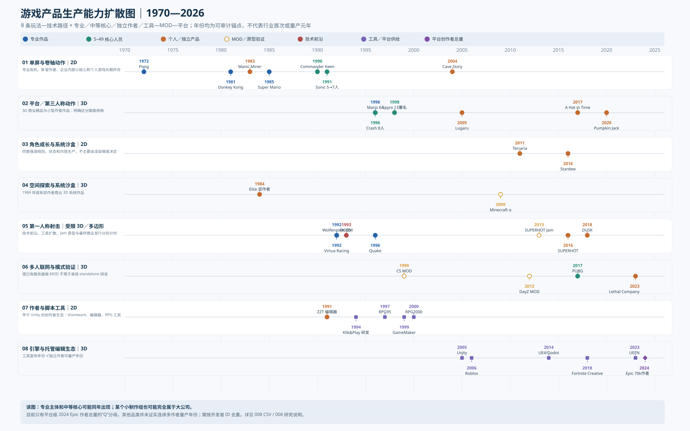
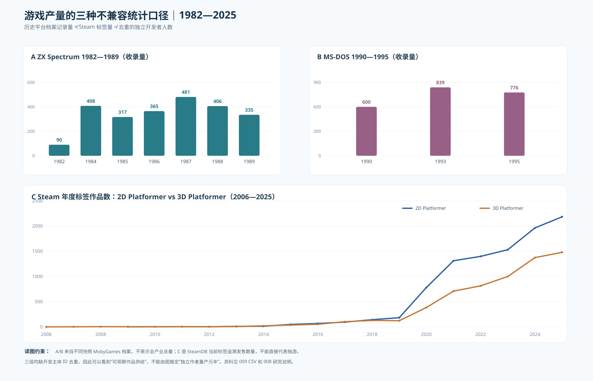
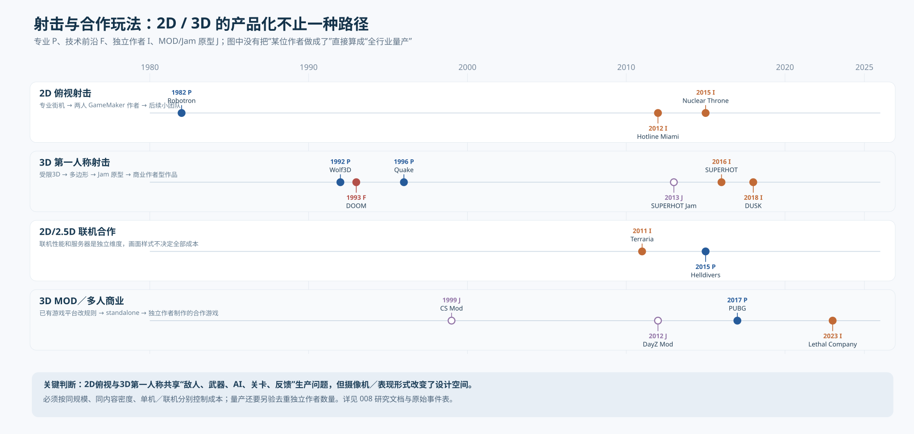

# 008 — 游戏产业技术—产品生产能力分代：跨品类年度证据与三张读图（1958—2026）

> **联网地理/市场可达性量化**：[016 — 中国1997—2010年实际联网能力：浩方、网吧、CF与韩美日宽带扩散](016-1997-2010-multiplayer-reach-and-market-infrastructure.md)。这是独立于2D/3D图形时代和网络协议发明年份的另一条扩散轴；原始年份与人群分母不允许和独立作者量产同列。

> **多人游戏范围与服务成熟度单独分代**：[015 — 同机派对、LAN、早期公网到全国性多人对战服务分代](015-local-lan-wan-national-multiplayer-production-regimes.md)。本机多人《Mario Kart 64》《Mario Party》《Smash》、早期CS/RTS的LAN与Internet并存、CF中国2008大规模在线商业化不是同技术阶段。[图](015-multiplayer-social-geography-regimes.svg)，避免把玩法相似当生产技术基础相同。

> **2026-10-10 作者经济量产层（Q）更新：**请先看 [017 — 2024 Fortnite创作者收益包含式漏斗与2024—2025 Roblox SEC真实现金兑换作者群](017-creator-economy-economic-viability.md)：Epic 原图的“≥$1M 37人”已经包含“≥$3M 14人”“≥$10M 7人”，不可误加成58人。

- Status: **图表化研究版 / 仍非全市场作者量产数据库**
- Snapshot: 2026-10-10
- Repository lane: B — 公开历史研究，非任何私人游戏项目制作建议
- 上游研究：[001 技术吸收](001-technology-absorption-framework.md) / [003 技术体制](003-game-industry-technology-regimes.md) / [005 历史年代表](005-game-production-capability-timeline.md) / [006 年度观测](006-annual-observations-dictionary.md) / [007 2D/3D 分代](007-genre-production-diffusion.md)
- **事件证据表**：[008-genre-role-year-events.csv](008-genre-role-year-events.csv)；**1982—1995 老平台样本**：[009-presteam-platform-release-observations.csv](009-presteam-platform-release-observations.csv)

> **2026-10-10 内容生产力补充：**新增 [012 — 二维/三维开放世界、3D时代内容收缩、三人多人游戏与独立沉浸式模拟研究](012-3d-content-contraction-and-indie-system-worlds.md) 及 [2D/3D内容年代矩阵](012-openworld-system-production-era-map.svg)、[成本替代机制图](013-content-cost-substitution-mechanisms.svg)。原文重点关注平台动作，此补充把可探索内容和游戏系统规模单独入轴。

> **新增联网技术的独立分代轴：**[014 — 网络架构与延迟补偿如何改变多人游戏玩法与作者可负担能力](014-network-regime-latency-compensation-and-genre.md)，含[1978—2026七轨技术年代图](014-network-capability-parallel-regimes.svg)，更正“MMORPG先于网战且长期唯一”“2009 GGPO SDK”误区。网络角色规模不得仅凭2D/3D画面形态推断。

## 本轮立即看图：三张图分别解答三类问题

### A. **哪种开发者在哪年做出了什么？**

[单独打开 8 轨 SVG（1970—2026）](008-genre-production-multitrack.svg)；按产品类型拆 2D/3D，标示专业商业、5—49 人已核核心、独立作者、MOD/Jam、引擎/UGC。每个点是公开日期锚点；**不是从此时起行业会做**。1958/1962 研究实验和1972商业化见 005 全年代图。

### B. **作品供给到底有没有上数量级？**

[单独打开历史档案与 Steam 产量 SVG](009-presteam-to-steam-production-volumes.svg)；**A/B/C 三个不同市场分母互不相加**。

### C. **2D 俯视射击、3D FPS、合作联网真能直接同一级比较吗？**

[单独打开 2D/3D 射击与多人对照 SVG](010-shooter-coop-2d3d-parallel.svg)；2D／3D 是表现坐标，不能替代主导技术难度的网络、内容、规则等维度。

## 1. 应将原有「五代」改为年度独立时钟

| 时钟 | 观测单位 | 不能混淆的项 |
|---|---|---|
| F — frontier | 演示及其年份 / 发明者 | 实验室 demo ≠ 经济产品 |
| P — professional | 某个商业项目/专业团队的能力 | 专业公司 ≠ 大制作组；受专用硬件支持的街机 ≠ 普通家庭PC |
| M — mid-core | **5—49 人的可核开发核心**（本文任意研究档位） | Sega内部 7 人既是小核心，也是大型母公司体系；credits人数≠FTE |
| I — creator | 明确作者或小团队的成品；原型标 I_PROTO | 接入外部发行、软件和外包必须列示 |
| T — tools | 引擎/编辑器/模组底座面世 | 1999 GameMaker ≠ 1999 独立 2D 量产 |
| Q — multi-author | 同一玩法/格式中去重的独立开发主体 × 年 | 作品数、注册账号、岛屿数量、全平台创作者数不可互换 |
| D — market | 分发、支付、测试、运营 | Steam 上架便利化 ≠ 技术实现变简单 |

**这种机制不该硬排成 F→P→M→I→Q：**
- 1983 Matthew Smith 的 `Manic Miner` 小作者商业 2D 平台动作早于 1985 年 `Super Mario Bros.`。后者是专业制作的*标杆*而非2D平台动作诞生。
- 1984 两人 `Elite` 是早期三维空间/模拟产品，早于主机实时多边形进入大量专业公司。**技术规格、表现方式、世界状态和商业完成度必须同时说明**。
- 1996 `Super Mario 64` 与核心约8人的 `Crash Bandicoot` 同年，而8人背后有 Naughty Dog／Sony 商业发行结构；不是大厂独享3D、二十年后才由中型团队学会。
- 2005 `Lugaru` [Steam/Wolfire](https://store.steampowered.com/app/25010/Lugaru_HD/) 说明独立3D第三人称动作早于2017 `A Hat in Time`；两者不是同子品类（动作格斗 vs 平台动作），不得把 2017 写成「3D独立产品开始」。
- 1991 `ZZT` 同时是个人 shareware 商业产品和用户可编程游戏编辑器，[Epic 作品页](https://store.epicgames.com/p/zzt) 与 [Sweeney 本人访谈](https://gamesbeat.com/epics-3d-graphics-wizard-tim-sweeney-says-business-and-technology-are-intricately-linked-interview/3/)支持这一节点。它提供了早期创作者量产**机制**，但未给出该年去重作品/作者数量。

## 2. 按年份推进的「2D／3D 同类类别 × 组织规模」矩阵

| 研究类别 | 2D 时间锚点与制作规模 | 3D 时间锚点与制作规模 | 已证实的 Q |
|---|---|---|---|
| 关卡平台/动作 | 1983 `Manic Miner` 作者型；1985 `Super Mario Bros.` 专业精品；1991 `Sonic` 内部5→7 | 1996 `Mario 64` 专业；同年 `Crash` 核心8；1998 `Spyro` 13人**为开发者署名小计**；2017 `A Hat in Time`、2020 `Pumpkin Jack` 小作者路径 | **UNKNOWN**：Steam 2D/3D 标签作品数量只是 Q-product-proxy |
| 游戏射击：平面俯视/第一人称 | 1982 `Robotron` [Williams原始说明书](https://www.robotron-2084.co.uk/williams/documents/robotron)；2012 `Hotline Miami` 两人 GameMaker / 外部发行；2015 `Nuclear Throne` [Steam](https://store.steampowered.com/app/242680/Nuclear_Throne/) | 1992 `Wolfenstein 3D` 受限射线投射；1993 `DOOM`；1996 `Quake`；2013 Jam→2016 `SUPERHOT`；2018 `DUSK` | **UNKNOWN**：FPS/Doom WAD/Steam历史标签不同分母 |
| 系统/探索/经营 | 2011 `Terraria`、2016 `Stardew Valley`，分别是不同规模的2D系统游戏 | 1984 `Elite` 双作者线框3D；2009 `Minecraft` 公开早期产品；系统负担不可按多边形数排队 | **UNKNOWN**：独立3D系统游戏作者群年份未核 |
| 多人规则与联机 | 2011 `Terraria` 2D沙盒支持联机；2015 `Helldivers` 俯视/2.5D合作，Arrowhead+PS外部支持 | 1996 `Quake`；1999 `CS` MOD；2012 `DayZ` MOD；2017 `PUBG` standalone；2023 `Lethal Company` EA | **UNKNOWN**：MOD作者数不能直接折算完整多人商业游戏团队 |
| 用户创作/编辑器 | 1991 `ZZT`；1994 制作中的 `Klik & Play`（上市1995的二手资料待核）；1997 `RPG Tsukuru 95`；1999 `GameMaker`；2000 `RPG Maker 2000` | 1993起 `DOOM` WAD；2005 Unity；2006 Roblox创作入口；2014 UE4/Godot；2018 Fortnite Creative；2023 UEFN | **2024 仅 Epic 的平台级 70,000 creators；**子品类去重 Q 仍 UNKNOWN |

特别要写在图旁边：**`Hotline Miami` 是两人协作、GameMaker 生产、Devolver 发行**，由 [GameMaker 2012 同期公告](https://test.gamemaker.io/en/blog/hotline-miami-developed-with-gamemaker) 直接确认；这比抽象说「后来可以用工具制作2D」更能说明技术如何变成创作产能。同样，`SUPERHOT` 从2013 Jam 到2016商业发行、扩组/众筹的真实路径，由[制作方 presskit](https://superhotgame.com/presskit/)直接证实。两条轨迹均**不能**折算成整个行业某年 Q。

## 3. 前 Steam 生产量级已经可以画，但不能盗换成作者群 Q

[2006—2025 SteamDB 标签图](007-2d-vs-3d-platform-production.svg)原来有左截断问题。新增 [009-历史平台观察CSV](009-presteam-platform-release-observations.csv) 后，前史有以下**MobyGames 当前或近年存档观察**：

| 平台 | 年份 | 收录的当年发售条目 | 重要局限 |
|---|---:|---:|---|
| ZX Spectrum | 1982 | 90 | 首期平台目录存在归档遗漏 |
| ZX Spectrum | 1984 | 408 | 包含多人／公司及合集 |
| ZX Spectrum | 1985 | 317 | 与2010年代Steam不可直接比较 |
| ZX Spectrum | 1986 | 365 | 动态归档 |
| ZX Spectrum | 1987 | 481 | 较早抓取页面，不能当同一时刻快照 |
| ZX Spectrum | 1988 | 406 | 动态归档 |
| ZX Spectrum | 1989 | 335 | 不是去重作者 |
| DOS | 1990 | 600 | 另一次快照599，说明资料会变 |
| DOS | 1993 | 839 | DOS 平台的总品类混合 |
| DOS | 1995 | 776 | 同时期 Windows 端产品另计 |

资料一览：[MobyGames ZX Spectrum 1984](https://www.mobygames.com/platform/zx-spectrum/year%3A1984/sort%3Adate/)、[1987](https://www.mobygames.com/platform/zx-spectrum/year%3A1987/)、[DOS 1993](https://www.mobygames.com/platform/dos/year%3A1993/)、[DOS 1995](https://www.mobygames.com/platform/dos/year%3A1995/sort%3Adate/)。

**结论边界**：可说在1980年代中期家庭电脑平台已有每年数百款被档案收录的游戏供给，足以否定「Steam 发明了独立作者的出货能力」；不能说这些全由个人制作，也不能通过不同平台的总发行数比较3D/2D难度。真实的分品类／分作者量产，须在档案中按作者、出品年份、原创/移植/合集去重。

## 4. 必须拆开两种拐点：引擎推出 vs 工具真正被大量作者使用

| 年份 | 提供的能力或新增成本降幅 | 证据 | 与 Q 的关系 |
|---|---|---|---|
| 1991 | `ZZT` 自带编辑器和对象脚本、shareware渠道 | [Epic](https://store.epicgames.com/p/zzt)；[Sweeney一手访谈](https://gamesbeat.com/epics-3d-graphics-wizard-tim-sweeney-says-business-and-technology-are-intricately-linked-interview/3/) | 开始可观察作者生态，不知1991作者数 |
| 1994–1995 | Clickteam作者回顾1994合作制作 `Klik & Play`，社区编年记1995上市 | [Clickteam](https://clickteam.itch.io/)；[历史编年](https://clickwiki.github.io/clickteam/history/) | 用「待进一步核年份」标注，不写死1994上市 |
| 1997 | 日本版 `RPG Tsukuru 95`；**95非上市年份** | [RPG Maker 资料索引](https://rpgmaker.net/engines/rm95/) | 工具供给≠商业作者数量 |
| 1999–2000 | `GameMaker` / `RPG Maker 2000` 可达 | [GameMaker](https://gamemaker.io/en/blog/gamemaker-25)；[RPG Maker商品页](https://www.rpgmakerweb.com/products/rpg-maker-2000) | 逐年引擎生态仍待作者 cohort |
| 2005 | Unity 首次发布 | [Unity历史公告](https://unity.com/news/unity-technologies-celebrates-six-years-continual-leadership-and-innovation) | 当年不能认定3D Indie Q |
| 2010 | Unity 报告 **250,000 注册开发者** | [Unity官方](https://unity.com/news/unity-technologies-surpasses-250k-developers-milestone-and-35m-installs-free) | **账号规模**，非出货人数 |
| 2012 | Unity 4.0 正式发布（11月14日），约150万注册开发者 | [Unity官方](https://unity.com/fr/news/unity-4-0-launches) | 已是开发者工具的大规模分发；仍不能推同类商业游戏数 |
| 2013 | Unity 4.3 专用2D工具正式加入（11月12日） | [Unity官方](https://unity.com/news/unity-releases-2d-tools-4-3-update) | 说明“Unity本来是3D工具、后来完善2D”；不能倒写 |
| 2014 | UE4 发布 $19/月订阅与Godot公开版本 | [Epic](https://www.unrealengine.com/blog/epic-games-releases-unreal-engine-4-for-all)；[Godot](https://godotengine.org/article/first-public-release/) | 技术供给窗口 |
| 2015 | **Unity 5 实际 2015-03-03 上市** | [Unity官方](https://unity.com/news/unity-5-here) | 不是2014上市 |
| 2018 | Fortnite Creative | [Epic](https://www.fortnite.com/news/creative) | 玩家与编辑器/分发绑定 |
| 2023 | UEFN | [Epic](https://www.fortnite.com/news/unreal-editor-for-fortnite-and-creator-economy-2-0-are-here-new-worlds-await) | 商业客户端、后端和用户群绑定的创作基座 |

因此，之前深度研究输出中 **「2000 Unity诞生」「2014 Unity 5」** 为错误日期；之前报告提出「大公司→中公司→独立→量产」作为确定五阶段规律也缺证，被上述反例推翻。必须从本课题基准材料中明确撤销，而不是后文保留两套相互矛盾的分代。

## 5. 到底何时可以宣称「多作者量产」？

建立一个以 `year × platform × product_scope × genre_fidelity × developer_entity_id` 为主键的生产库；一位作者每年多作需要记录原始作品但去重作者。

**Q 检验建议，不等于自然界真正阈值：**
- Q1：一个产品品类×平台×年份至少20个可确认、互不重复的**开发主体**发表合格完整作品（若仅 jam 则标 Q-JAM，不与商业成品混用）。
- Q2：连续三年 Q1 成立且每年有新开发主体进入；只有同一主体连续出30款不能通过。
- Q3：另有真实销售/收入、付费率或者可持续资助证据，**不把大量上架当大量生存盈利**。
- 灵敏度：并行展示 `≥10／≥20／≥50` 开发主体阈值和 `≥1／≥2／≥3` 连续年份门槛，不用一条任意标准定义史实。

**截至本轮证据**：1982—1989 Spectrum 和1990年代 DOS 是 **Q-product-catalog**；Steam是 **Q-product-tag**；GGJ是 **Q-jam-submission**；Epic 的2024 70,000是 **Q-platform-creator**，其198,000 islands是 **Q-platform-artifact**。前四种不能代替真正的 `Q-genre-commercial-indie`。

## 6. 产品生产成本不能只按二维／三维和团队人数估计

对每个案例至少记录：
`renderer/physics` `art-animation effort` `gameplay systems` `world/level content` `netcode/backend` `testing/QA` `tool integration` `market/operations` `core person-month` `external person-month` `outsourced spend` `publisher/platform support`。

同类控制变量依次为：
1. 目标体验（平台动作、射击、系统沙盒、同屏/联网co-op）；
2. 目标平台与输入装置；
3. 单人／多人、是否使用已有MOD基座；
4. 渲染和动画的目标品质；
5. 内容规模／资产重复使用率；
6. 项目起点（原型→EA→1.0）和人工口径；
7. 获客与财务可持续性。

1982 Williams arcade 的2D twin-stick 作品，与2012两人 `Hotline Miami` 在玩法族谱上有关，但二者的工具、交互目标、商业发行和内容量不同；任何“30年降了X倍制作费”的结论都需要额外成本样本。2012 `Hotline Miami` [制作方当期开发证据](https://test.gamemaker.io/en/blog/hotline-miami-developed-with-gamemaker)，2013→2016 `SUPERHOT` [官方开发叙述](https://superhotgame.com/presskit/)可以成为同类实证研究的起点，但不能代替整体样本。

## 7. 后续研究所真正缺少的分母（按对结论的影响排序）

1. **1977—2005 区域与平台历史作者 cohort**：ZX Spectrum、Apple II、BBC Micro、Amiga、DOS shareware、日式 RMW 作者等平台的当年唯一原始作者数；标出移植/合集/改版／商业及非商业，固定抓取日。
2. **2010年代以后 Steam 产品作者去重**：获取 AppID、genre、2D/3D渲染形式、制作方 ID、真实核心人数、发行商、是否工具生成／资产复用；不能将Steam标签/引擎检测即当做独立开发者身份。
3. **同类产品成本**：1990s小组与2010s独立开发者之间真正可比的年人月、预算、合同工、发行/QA/移植支持，用于对比技术工具使哪段成本下降。
4. **UGC→standalone 能力迁移**：1991 ZZT编辑器、Doom WAD、2000 RPG Maker、2012 DayZ Mod、2023 UEFN 的作者训练、产品边界、商业承接率；收录未成功者。
5. **美术规格的独立维度**：像素/手绘骨骼动画、sprite→低多边形→精细模型与动态光照等一律作为制作规格，不作为2D/3D二元高低分代。

在缺这些分母以前，**严禁伪造四条连续的大／中／小／多作者量产曲线**；采用带空格的阶段证据图才是严谨图表化，而不是失败。随着队列数据库补齐，可以将事件点升级为实际作者数年度序列。

## 来源等级与脚注约束

- P0 原始发行方/开发方当期发布：Epic ZZT、GameMaker Hotline、Unity/UE4/Godot/Epic官方工具发布日期、SUPERHOT presskit、Steam作品页面。
- P1 迟到的一手回忆：Sweeney、Sonic团队人数、Naughty Dog首作核心人数。
- S1/S2 汇编：MobyGames、World of Spectrum、ClickWiki/RPGMaker编年，尤其作者人数和旧作年份的二手冲突需进一步核档案扫描。
- 不对全市场给出“2D作者量产元年”与“3D作者量产元年”；任何可计算的作品间隔（如1996→2017）均是**选样点间隔，不是普及滞后**。
