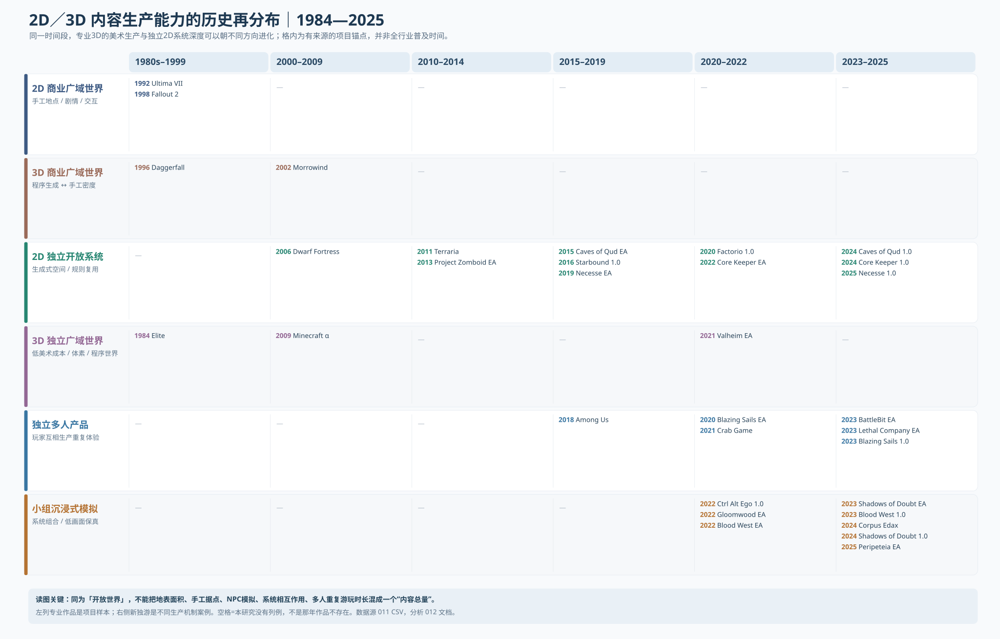
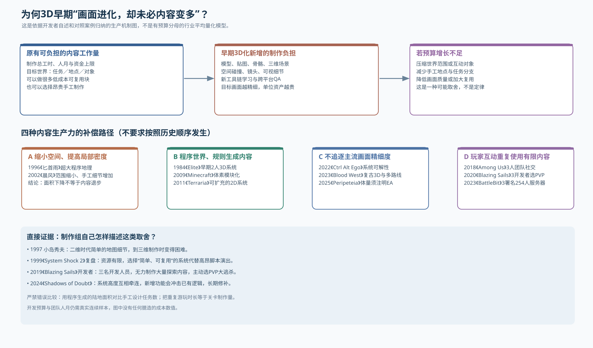

# 012 — 从2D广域世界到3D内容收缩，再到独立作者的系统世界、多人游戏与沉浸式模拟（1984—2026）

- **Status**: PUBLIC RESEARCH / AUDITED EXPANSION, NOT FULL INDUSTRY QUANTIFICATION
- Research date: 2026-10-10
- Scope: 公开游戏产业史；**不要掺入私人游戏项目技术或商业资料**。
- Canonical preceding: [005 初始年代地图](005-game-production-capability-timeline.md) / [006 年观察](006-annual-observations-dictionary.md) / [007 品类技术路线](007-genre-production-diffusion.md) / [008 8轨图谱](008-audited-genre-capability-atlas.md)
- New case rows: [011 — 33 条具体作品生产模式、制作规模与来源 CSV](011-open-world-small-team-immersive-multiplayer-cohorts.csv)
- Figures: [012 分2D/3D的开放世界/小团队多人/沉浸式模拟年代矩阵](012-openworld-system-production-era-map.svg)；[013 3D成本与内容取舍机制图](013-content-cost-substitution-mechanisms.svg)

## 0. 先看图：1980年代到2020年代出现的不是一条线

**核心命题（严格版）**：
1. **视觉表现提高与内容生产效率可能反向运动。** 1990年代的多边形3D带来新的模型、空间、镜头、动作和QA负担；对特定工作室而言，这种新增成本会压缩可以手工制作的地图/地点/任务数量。**但不是3D游戏普遍比2D内容更少，也不是整个产业总产出萎缩。**
2. **“内容”不是一个单一变量**。世界地理面积、手工任务数、可互动对象密度、玩法系统数量、物品/动画资产数、程序生成多样性、可重复游玩时长是不同口径，禁止相加成无来源的“内容分”。
3. 2010年代2D系统世界的高完成度小团队作品再度集中出现，同时3D低画面规格、体素、程序生成路线也成熟；后者不是所谓“独立3D根本不可能”。
4. 2010年代末至2020年代初，**少量作者做“单模式多人PVP/合作”与“系统型沉浸模拟”的成套体验**证据增加，主要依靠公用引擎、中间件、可复用规则、低资产规格、平台发行、EA与社区反馈的*组合*，不能说仅仅靠引擎更先进。
5. 这些是**经验证的作者生产路径案例**，还不是某品类从这年开始全市场“多作者量产”Q1/Q2/Q3；需要去重开发者分母。

## 1. 1990年代“3D化让内容缩水”：拆成至少三个可以核验的命题

### 1.1 相同预算下制作高保真3D的边际内容成本可能上升

- **同期开发者一手证言**：小岛秀夫1997年谈从MSX二维概念转做《Metal Gear Solid》时，承认原先二维制作中显而易见、容易处理的事，到多边形环境难得多；为实现视觉真实，连家具造型与柱子几何细节都成为制作负担。[1997 开发者采访保存稿](https://shmuplations.com/metalgearsolid1997/)。
- **更早、并不完全由3D导致**：《Ultima VII》1992年以连续可探索地图、丰富物品和交互作为二维世界标杆；此后《Ultima VIII》1994年把更多精力投入动作动画与画面，Richard Garriott 在1996年的历史访谈中承认其世界细节受到牺牲。此句目前主要由[转录汇编档案](https://newikis.com/en/Ultima_IX%3A_Ascension)保留，作为**次级转述证据**，须再取得1996原始刊物才可升级。因此机制并非“进入3D才开始缩水”，**追求更高演出规格就可能挤占世界内容预算**。
- **作品世界配对**：1996《The Elder Scrolls II: Daggerfall》依靠程序地理产生超大区域（Guinness记录188,000平方英里）；2002《Morrowind》换为约24平方公里、手工组织并具可拾取/收集物体的更高局部密度世界。两个面积来自不同文献和测量口径，不得无视程序生成和交互密度直接除出“2002内容缩小了多少倍”。[Guinness](https://www.guinnessworldrecords.com/world-records/109428-largest-playable-area-in-an-rpg-videogame)／[PC Gamer专业史回顾](https://www.pcgamer.com/the-evolution-of-the-elder-scrolls/3/)。
- **反例必须同页给出**：2001《Grand Theft Auto III》、2002《Morrowind》已经是3D广域世界商业作品；1984双作者线框模拟《Elite》更早有3D广域系统概念。因此“1995以后3D技术导致开放世界整体消失”的断言为假。

### 1.2 规模不是内容：建立六维“广域世界产出”记录

对每件作品单独采集（目前多数依然 UNKNOWN）：

| 变量 | 严格单位 | 二维/三维对比的混淆因素 |
|---|---|---|
| `WORLD_AREA` | 可移动地图面积／航行节点数，注明地图单位 | 1996 Daggerfall程序地理 vs 2002 Morrowind手工版图，不能直接代表“有事可做” |
| `AUTHORED_POI` | **不重复**的人工作业场景／命名地点／支线和独立对话段数 | 手写文本与3D有声表演生产工时迥异 |
| `SIM_DEPTH` | 可记录/影响的对象与状态类型、玩家动词及可组合规则 | 每一种系统的相互作用未必需要一份新地图 |
| `ASSET_COST` | 游戏角色/环境/动画/音频的**总实际人时与外包支出** | 2D手绘高密度不必然比3D低成本 |
| `ACCESS_AND_CONTINUITY` | 城市/地表是否互通，存档状态、任务自由顺序 | 分关卡动作、开放RPG、地理沙盒不是完全同一玩法类别 |
| `REPEATABLE_PLAYER_HOURS` | 可验证游玩时长分布／多人重复局数（不是开发者自报上限） | 高重复时长不是同等数量人工制作任务 |

**产能命题形式**：同一制作预算和目标平台下，随着每个高质量场景/动画/交互资产的制作人时上升，若不降低精细度或改善生产工具，*可以手工完成的不同内容量*可能下降；项目可能转向**①更密集的少数手工场景 ②程序生成与组件复用 ③更便宜的视觉语汇 ④以系统和玩家互动生产差异化体验**。此为**约束模型**，无连续数据之前禁止画一条假的“1990—2020平均内容下降/上升指数”。

### 1.3 首批历史可比案例矩阵

| 技术—时代 | 代表 | 视觉表现 | 玩家可得内容机制 | 核心比较限制 |
|---|---|---|---|---|
| 1992/1994 二维 CRPG | `Ultima VII` → `Ultima VIII` | VGA2D／更强调角色动作与演出 | 前者物件和广域世界；后者更追求动画精细 | 是同IP演出取舍，但还不属于多边形3D对比 |
| 1996早期混合3D | `Daggerfall` | 3D地形/空间与2D billboard 混用 | 程序生成大量地理位置 | 面积不等于人工内容或可用性 |
| 2001—2002商业3D世界 | `GTA III`／`Morrowind` | 主机/PC多边形3D | 高密度手工环境/系统交互 | 已证明商业3D广域世界并未停产 |
| 2006—2011独立2D/3D系统 | `Dwarf Fortress`／`Minecraft`／`Terraria` | ASCII/2D sprite/3D voxel | 重用规则与程序生成空间 | 更大的是系统复用而不必是手工任务数 |
| 2011—2025独立2D世界集群 | `Zomboid`、`Factorio`、`Starbound`、`Qud`、`Core Keeper`、`Necesse` | 简化美术/2D局部 | 规则、生成地形、建造、角色/任务、多人、长期增量 | 分别是生存、自动化、roguelike、合作沙盒，不能当“同一细分品类量产” |
| 2021起小队3D沙盒 | `Valheim` | 低面数/风格化3D | 程序世界、采集建造、合作 | 与2010年代3D大厂高保真巨型开放世界不同成本档位 |

## 2. 2010年代独立2D开放世界重兴：不是单一类型，而是多种低资产高系统生产路径

### 2.1 按原型—EA—1.0重新排列而不是按Steam标签误判首次

| 作品 | 可核年份与生产方式 | 内容生产的乘数 | 对“2D世界重新出现”的真正贡献 |
|---|---|---|---|
| `Dwarf Fortress` | 2006免费版，2022 Steam商业图形版（[Steam](https://store.steampowered.com/app/975370/Dwarf_Fortress/)）；早期2兄弟路线 | 生成式世界历史、矮人状态、社会/经济系统 | 成本重心在规则/模拟，而非卖单帧画面 |
| `Terraria` | 2011商业上市（[Steam](https://store.steampowered.com/app/105600/Terraria/)） | tile世界、装备/首领/建造、联机可复用 | 非传统手写主线RPG，但大型玩法总量来自规则组合 |
| `Project Zomboid` | 2013-11-08 Steam EA（[开发者Steam公告](https://steamcommunity.com/news/post/1027113495079429728/)）；更早公开开发时期单独注明 | 生存状态、城镇探索、技能/建造、合作 | 2D/等距世界承载接近“完整生存模拟”体验 |
| `Starbound` | 2013 EA→2016 1.0；2013项目预购筹得逾$1m、三个月售出逾1m据工作室自述 [开发者presskit](https://playstarbound.com/presskit/) | 各星球重复利用tile与规则，再加手工剧情 | 技术成本与早期消费者预付资金共同构成可完成条件 |
| `Factorio` | 2012开工、2016 Steam、2020 1.0；厂方说从2程序+1美术成长到约30人 [presskit](https://factorio.com/support/press-kit) | 无限2D世界，生产线与物理流系统相互作用；其图像素材还从3D模型制作 | 2D成品不等于纯2D素材流程，更不等于2020版本由3人完成 |
| `Caves of Qud` | 2010 beta、2015 EA、2024 1.0；2024团队自述历经17年 [作者2024发布公告](https://freeholdgames.itch.io/cavesofqud/devlog/845582/caves-of-qud-10-out-now) | 生成历史、角色突变、生物/社会和行为组合 | 画面低门槛不代表系统设计/调试没有时间成本 |
| `Core Keeper` | 2022 EA→2024 1.0、支持1—8人合作 [Steam](https://store.steampowered.com/app/1621690/Core_Keeper/) | 世界开采、建造、养殖、装备与合作 | 确证独立制作2D广域系统型多人作品；发行方支持另计 |
| `Necesse` | 2012作者业余爱好开始→2019 EA→2025 1.0。**制作方presskit明确最初单人、后来扩至7人** [presskit](https://necessegame.com/presskit) | 程序世界+定居点经营+行动冒险+联机 | 演示了“先单人搭规则底座，取得收入后扩大组织”的时间性 |

**不得把所有以上作品叫“2010年代新发明的2D开放世界”**：早在1980—1990年代已有2D大型空间/深系统产品；真正变化是低规格图形+长期测试分发+规则复用重新提供了**微团队可负担的替代生产路线**。与此同时，2010年前后的 `Minecraft` 与2021 `Valheim` 说明3D也可沿体素/低多边形/程序生成路线降低广域游戏门槛。

## 3. 2018年之后独立多人游戏：把“内容”从制作组交给玩家间互动

**最强一手反例：2019 年 Epic《Blazing Sails》开发者专访。** 工作室当时四位亲戚：**三位开发者+一位社区经理**；Frederic Degraeve明确解释，考虑到只有三位开发者，他们做不起需要大量手工探索内容的探索型游戏，于是选择可用玩家对抗与海战循环复用内容的海盗大逃杀。开发方已学习 UE4，且还有 VAF/Flanders Game Fund、Epic MegaGrants 和 Iceberg Interactive 发行支持。[UE4官方开发者专访](https://www.unrealengine.com/developer-interviews/a-family-bands-together-to-develop-pirate-battle-royale-game-blazing-sails)／[开发方 presskit](https://www.blazingsails.com/presskit)／[Steam 2020EA/2023 1.0](https://store.steampowered.com/app/1158940/)。这能**直接证明以玩法结构逃避内容资产成本是有意识的决策**，不是假设“几个人无所不能”。

| 作品 | 发行与人员证据 | 完整体验或强项 | 被排除／外部转移的成本 |
|---|---|---|---|
| `Among Us` | 2018初版；制作方回顾当时3人 [Innersloth](https://www.innersloth.com/press-kit-among-us/) | 社交推理、联机地图与日常玩家参与 | 最初只有本地模式，后来增加线上，2020爆红不能倒写为2018即完备 |
| `Blazing Sails` | 2019三开发+社区负责人；2020 EA / 2023正式 | UE4风格化3D、海盗船操作、角色战斗、组队PVP | 以重复PVP替代大规模手工探索；另有外部发行/资助 |
| `Crab Game` | 2021，Dani本人开发视频说约三周，并明确前作Muck积累的联网经验 [开发者视频](https://www.youtube.com/watch?v=_ze26M_Fm6g) | 简化3D、多人淘汰规则、多局重玩 | 已有工具与个人前史，免费平台创作者渠道，不是泛用3周联网开发平均值 |
| `BattleBit Remastered` | 2023 Steam EA；商店署名SgtOkiDoki/Vilaskis/TheLiquidHorse，最多254玩家/服 [Steam](https://store.steampowered.com/app/671860/BattleBit_Remastered/) | 低多边形多人FPS，载具、破坏、高并发大场面 | 核心署名3个不证明全部外包、服务器及长期运营成本只有3人 |
| `Lethal Company` | 2023EA，Zeekerss署名 [Steam](https://store.steampowered.com/app/1966720/Lethal_Company/) | 可重玩恐怖合作、语音协作及意外互动 | 系统/怪物少于大型剧作单机，不表示无需多人测试与后续支持 |
| `Valheim` | 2021 EA时五人团队，Coffee Stain发行 [华邮访谈](https://www.washingtonpost.com/video-games/2021/03/09/valheim-developer-interview-updates/) | 程序3D世界、生存建造和多人 | 低面数视觉与程序复用，不能冒称AAA手工开放世界资产同档 |

**反向提醒：** 互联网中间件缩减做出第一版的成本，**不消灭运营成本**；服务器、反作弊、平台账户、恶意玩家、复现bug、同步测试、长期内容和社区仍需资源。也不能把 “2023三署名254人同服”推广成全行业小团队均能承担254人服务器系统。

## 4. 3D独立沉浸式模拟：原创规则组合并没有因画面简化而“缺胳膊少腿”

本轮用户提供的 EphiTV《The Golden Age Of Indie Immersive Sims》（2022-11-23）适合建立 **immersive-sim/related** 独立创作 cohort，但不是所有视频点名项目都满足完全同一 genre 标准。建议按照**交互动词/多路径问题解决/物理与AI系统一致性/关卡可达性/持续状态**独立打标，而不是只看 Steam 的“Immersive Sim”用户标签。

| 作品 | 发行状态（重要） | 系统/内容优势 | 正确开发主体/外援口径 |
|---|---|---|---|
| `System Shock 2` | **1999已商业完成** | RPG能力、潜行/战斗、可复用AI/物品/安防、叙事音频日志 | 1999 **$1.7m预算、18个月、15名全职+10–15名兼职**，继承尚在开发中的 Dark Engine，与 Looking Glass合作且EA发行；数据见[当期Game Developer复盘PDF原刊53页](https://media.gdcvault.com/GD_Mag_Archives/GDM_November_1999.pdf)。这是重要的**中等核心＋工业支持**技术参照。 |
| `Ctrl Alt Ego` | **2022-07-22商业1.0** | “自我”附身机器、分布式谜题、潜行/物件/策略的路线组合 | [MindThunk一手presskit](https://mindthunk.com/media-kit-1)：2015先两名兼职资深开发者，2019分道，一人转全职推进，2021 Demo、2022发售。**不能说只用一个人一年做完了3D沉浸式模拟**。 |
| `Gloomwood` | **2022-09-05 EA**，非1.0 | 空间潜行、资源/武器管理、复古风格化3D | [Steam](https://store.steampowered.com/app/1150760/Gloomwood/)列4名开发者、New Blood发行；“四个名字”不是全部项目FTE。 |
| `Blood West` | **2022-02-10 EA → 2023-12-05正式** | 3个非线性地区、潜行与枪械/RPG，商店写20+小时 | [Hyperstrange开发公告](https://hyperstrange.com/2022/02/welcome-to-blood-west-gunslingers/)／[Steam](https://store.steampowered.com/app/1587130/)；可标**immersive-lite / stealth-FPS**，不是严格 System Shock同规模。 |
| `Shadows of Doubt` | **2023-04-24 EA → 2024-09-26正式** | 程序生成城市、居民模拟、潜在证据、自由侦查 | [ColePowered 2018系统说明](https://colepowered.com/shadows-of-doubt-devblog-2-finding-the-game/)／[2024 1.0开发日志](https://colepowered.com/shadows-of-doubt-devblog-1-0/)：约8年开发，后来扩组并有Fireshine发行；**系统组合的复杂度引发大量bug和修补**。 |
| `CORPUS EDAX` | **2024-09-05正式** | 第一人称近战、对话/潜行/暴力多路径、物理交互 | [Steam](https://store.steampowered.com/app/2017610/Corpus_Edax/)署名Luis G. Bento自发行；署名个人≠所有资产/服务全自行承担。 |
| `Peripeteia` | **2025-02-21 EA**，不是已完成1.0 | 立体城市可攀爬、潜行、黑客、对话、不同进入路线 | [Steam](https://store.steampowered.com/app/1437760/Peripeteia/)当前自述5个任务、30+小时，数字可随补丁更新；Ninth Exodus团队独立发行，开发人数未核。 |

### 4.1 截图视频的三项名单查漏：其中一部其实是2D，另一部尚未发行

- **`Deadeye Deepfake Simulacrum`：** 核验年份为 **2022-10-13 Early Access → 2025-09-18 1.0**；而且它是**2D俯视角射击＋黑客/时间操纵/程序装备的系统型游戏**，不是3D FPS。作者/发行均为 `nodayshalleraseyou`。它表明沉浸模拟复兴跨越2D/3D，美术维度与系统驱动不是一根轴。[Steam商店](https://store.steampowered.com/app/1545990/Deadeye_Deepfake_Simulacrum/)。
- **`Ad Infernum`：2024-02-29 正式发行的第一人称恐怖/生存/沉浸模拟倾向作品**，Glass Knuckle Games开发与发行。商店证实产品而不证实一人制作；核心FTE记 UNKNOWN。[Steam商店](https://store.steampowered.com/app/1390070/)。
- **`Sorceress`：到2026-10-10 Steam仍标 To Be Announced、仅提供Demo**，Wabbaboy开发及拟发行。它可以进入 `I_PROTO / UPCOMING` 能力证据池，却不能算已完成商业沉浸模拟，更不适合倒算2022视频发表当年的实际新作数。[Steam商店](https://store.steampowered.com/app/2168070/Sorceress/)。

**视频在2022年同时讨论已上市、EA和将来可能上市的项目**，今后的视频引用至少要分 `public_demo / early_access / full_release / announced` 四类。此项已补入 [011案例CSV](011-open-world-small-team-immersive-multiplayer-cohorts.csv)。同一时间还有大量视觉不是3D但系统深度相似的游戏，独立沉浸模拟绝不能被狭义定义为3D。

**1999年 `System Shock 2` 是一个强有力的方法控制组。** 当时三位创办人的早期原型借用已有 Dark Engine、外部合同美术，取得EA发行后才扩成15名全职加10–15兼职的正式项目；项目经理Jonathan Chey在原始复盘中明确写到他们避免直接和Half-Life竞争复杂脚本演出、高多边形图形，专注可反复发挥的规则。这个“技术基座复用—早期小组原型—根据资源定玩法—正式商业投入”的机制并非2020年代独游首次发明，而是**后来更加广泛可负担**。原始复盘 [PDF第32页（阅读器零起索引31，对应刊物页53）](https://media.gdcvault.com/GD_Mag_Archives/GDM_November_1999.pdf)，以及[GameDeveloper文字复刻](https://www.gamedeveloper.com/design/postmortem-irrational-games-i-system-shock-2-i-)。

**2024小队 `Shadows of Doubt` 又提示相反代价**：低资产规格、程序生成能扩大玩家可探索世界，但居民日程、物件历史、罪案生成与玩家自由行动产生巨量状态空间。设计与QA的负担不一定下降，只是从“美术内容人工量”转移到“系统一致性和调试工时”。[2018作者技术反思](https://colepowered.com/shadows-of-doubt-devblog-2-finding-the-game/)；[2024正式版后修补说明](https://colepowered.com/shadows-of-doubt-devblog-looking-forwards/)。

## 5. 这与「3A精细却不耐玩」讨论如何关联：不以审美评价替代产品经济学

图片中 2026-08-28 的评论核心可以拆为：
- H1 **某些高保真3D游戏/线性剧作更依赖昂贵单次消费内容**；手工可玩小时的边际成本较高。要使用同类型、同目标画质和有来源的人月数据验证。
- H2 **多人PVP、合作、生存/自动化/系统模拟能把较少手工内容复合成较多玩家体验**。有开发者明确例子（Blazing Sails / System Shock 2），但不能推出成本为零，不能直接把“可重玩性”评价等同“更好玩”。
- H3 **一些AAA减少玩家能主动操纵的规则/可解路径而增加画面演出**。这需要游戏层面的可量指标（动词数/系统组合、不可互动资产占比、脚本锁定时间、状态持久性），否则只算评论者主观观察。
- H4 **独立厂商因不追求高规格资产能维持/恢复高规则密度作品**。现在有多个案例，但分母/失败组不足以推出“只有独游抵抗、AAA都不做深系统”的整体量级结论。
- **反例必要**：1990s低预算专业中型 `System Shock 2` 实现深系统；2020s部分独立 `Shadows of Doubt` 也有庞大的性能/QA成本；3D早期并非全部世界萎缩（Daggerfall、GTA III、Morrowind）。

**建议正文使用“内容生产力的迁移”和“画面规格与系统深度解耦”作为小节主题，而不是把所有变化写成3A与独游道德对立。**

## 6. 下一轮真正应画的定量曲线：数据建模，不填无据数字

**案例主键**：`game_id × version_date × platform × visual_format × genre_family × production_substrate`，不同EA/1.0的核心团队、预算与资产规格单独记录。

新增采集字段：
- `core_fulltime_fte_at_prototype`、`core_fulltime_fte_at_ea`、`core_fulltime_fte_at_1_0`
- `parttime_total`、`contractor_person_months`、`publisher_support`、`grant_support`
- `budget_nominal_local`、`budget_usd_at_release`、`development_months_start_def`
- `art_asset_hours`、`unique_authored_poi_count`、`unique_quest_arcs`
- `system_count_definition`、`player_action_set`、`interaction_pair_count`、`persisted_world_state_variables`
- `world_generator_used`、`map_area_source`、`map_authored_fraction`
- `network_topology`、`max_players_supported_verified`、`backend_host_cost`、`support_months_after_launch`
- `multi_author_genre_cohort_unduplicated`、`source_link`、`evidence_grade`、`unknown_reason`

**可做的纵向研究路线**：1992 `Ultima VII` / 1994 `Ultima VIII` / 1999 `System Shock 2` / 2002 `Morrowind`（存量团队制作强度及资产内容取舍）；2006 `Dwarf Fortress` / 2011 `Terraria` / 2016 `Factorio` EA / 2019 `Necesse` EA / 2024 `Caves of Qud`（系统型2D作者扩散）；2018 `Among Us` / 2020 `Blazing Sails` / 2023 `BattleBit` / `Lethal Company`（多人产品重复价值）；1999 `System Shock 2` / 2022 `Ctrl Alt Ego` / 2024 `Shadows of Doubt`（沉浸式模拟的成本取舍）。

**关键门禁**：资料中如果仅有一部作品的地图面积，不能画“全产业世界面积指数”；如果只知道一家工作室2019年3开发，不能将其他年份工时全写3FTE；如果只有Steam评论数或商店标签，则不能证明不同作者持续量产Q。图中无数据的具体人数、预算、内容量一律 UNKNOWN。

## 7. 建议在本书中的位置及复用

本篇作为工业革命比较区 `012`，交叉链接 `007/008` 既有2D/3D同品类地图。传记中引用应只摘“谁在当时因为什么成本限制选择了什么产品/技术底座”，而非根据成功倒推全球普及率。尤其要将：
- `Blazing Sails` 2019 三开发选择低手工内容PVP的自述；
- `System Shock 2` 1999 原始复盘的**$1.7m/18月/15全职+10–15兼职**与“可复用系统”策略；
- `Ctrl Alt Ego` 多年前史 + 1人收尾；
- `Shadows of Doubt` 从独立系统创新到巨量bug负担；
- `Necesse` 2012单人→2019EA→2025团队7人
分别登记为可复核决策事实，其他项目可链接并统一套用机制，不要求所有传记都填“同构”套话。

参考证据以文内内链及 [011 数据表](011-open-world-small-team-immersive-multiplayer-cohorts.csv) 为主，未逐项实测所有游戏的内容资产数量或游戏时长。未来如收集更多数据，应优先写入量化库，而不是先把理论结论写成确定结果。
