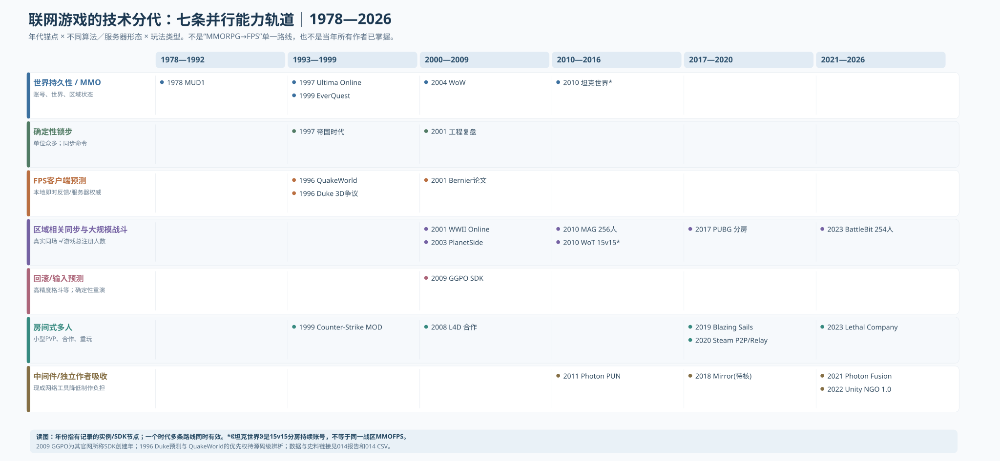

# 014 — 联网技术分代与多人玩法的可行解空间（1978—2026）

- Status：**公开史料对照 + 史料年份图表化 / 非全行业作者统计**
- Updated：2026-10-10
- Research scope：网络协议、延迟补偿、规模化复制、游戏类型及小作者可负担性；不混入私人游戏项目文档。
- 资料：2023-03-24 公共文章[《如何看待〈魔兽世界〉退出中国市场，多人在线端游是否已经被年轻人抛弃？》](https://www.zhihu.com/question/591472540/answer/2951419852)（用户上传的作者原文备份，经HTML `itemProp=text` 八段文字还原）；先前关于客户端预测/回滚/锁步的研究议题；可公开核验的原始技术/项目资料。
- **重要审计限制**：用户提供的[ChatGPT分享链接](https://chatgpt.com/share/6ac9c64f-12dc-83ec-ba3b-1cb008652914)在本轮公共网页读取失败，不能宣称已经逐字复核那段对话。其核心技术课题——锁步、客户端预测与服务器修正、插值/外推、回溯命中、GGPO回滚、AOI、网络中间件——已用公开原始材料独立核验。
- Source rows：[014-online-network-technology-events.csv](014-online-network-technology-events.csv)；图：[014-network-capability-parallel-regimes.svg](014-network-capability-parallel-regimes.svg)。
- 交叉阅读：[003 技术体制](003-game-industry-technology-regimes.md)／[007 2D/3D×组织规模](007-genre-production-diffusion.md)／[008 图表审计](008-audited-genre-capability-atlas.md)／[012 内容成本与微团队多人](012-3d-content-contraction-and-indie-system-worlds.md)。

## 1. 图：联网技术不是“MMORPG→MOBA→FPS”单调升级的单线史



[独立打开SVG](014-network-capability-parallel-regimes.svg)

至少需要彼此正交的**三条时钟**：

1. **K｜基础网络交互可行性**：在当时的网络延迟/抖动/带宽、终端CPU上，动作、打击判定、单位模拟、持久世界是否可行？代表节点：`MUD1 1978`、`QuakeWorld 1996`、`Age of Empires 1997`、`Valve Bernier 2001`、`GGPO 2009`。
2. **S｜专业/大型游戏服务的可复现性**：已经有哪一类真实商业产品证明可交付？代表节点：`Ultima Online 1997`、`EverQuest 1999`、`WWII Online 2001`、`PlanetSide 2003`、`MAG 2010`、`World of Tanks 2010`。
3. **I｜独立作者吸收既有网络能力**：是否出现低成本、可复用、可检验的引擎/库/托管/Relay/Matchmaking及真正成品？候选节点：`Half-Life MOD 1999`、`Photon PUN 2011`、`Steamworks 2020`、`Unity Netcode for GameObjects 1.0 2022`、`Lethal Company 2023`。

**不能把一条线的节点当另一条线的“首次”。** 比如有1996年专业FPS的客户端预测，不意味着1996年独立开发者可用成熟的免费跨平台联网SDK做现代全球联机游戏；2011 Photon PUN上市也不意味着2011年的所有独游作者已能自负后端负担。

## 2. 这篇知乎文章真正提出的可研究假设：网络预算会影响玩法选择

作者原文主要主张：
- 早期大众互联网对交互频率/同步规模的约束使MMORPG/RPG技能设计较适配；不代表时代只容许MMORPG。
- `World of Tanks` 利用较低移动速度的载具战术节奏和 BigWorld 引擎取得与旧式MMORPG不同的网络竞技产品形态。
- 2000年代后分房竞技/合作玩法（例如`Left 4 Dead`）与账号长期成长型多人产品互为替代；2010年代后大型战争/射击玩法进一步发展。
- `Destiny`、`Escape from Tarkov`、`Heroes & Generals` 与传统MMORPG应按不同“即时间动作与数值成长”权重比较。

研究该论点的**最强版本**应写为：

> 游戏规则与交互节奏是网络能力的内生设计变量：当当代基础设施或引擎无法经济地支撑某种同步规模、输入频率和判定精度时，开发者会选择更容忍延迟的玩法，或将“世界/匹配/服务器持久化”拆成不同层级；网络技术的吸收进步允许更多玩法组合成为可制作的商品。

但原文两处不应作为史实直接写入：
- **“当时只能做MMORPG”错误且过度绝对**：1996 `QuakeWorld` 已针对拨号互联网高速FPS建立本地预测，[Carmack 1996-08-02同期计划](https://www.gamers.org/dEngine/quake/archive/a_july96/0000.html)。2001 `WWII Online` 和索尼2003 `PlanetSide` 都已是专业商用大型在线射击。后者索尼原始新闻稿明确标为 2003-05-19 发售的“massively multiplayer online first-person action game”。[SOE 2003原厂发布](https://sony.mediaroom.com/2003-05-12-Sony-Online-Entertainment-Unveils-Latest-Video-Games-at-2003-Electronic-Entertainment-Expo)。
- **“MMOFPS已经是欧美最主流MMO、年轻人抛弃MMORPG”没有统一样本分母**：必须有同年度、同地区和年龄段的活跃玩家人数、游戏时长、消费、并发；且 `World of Tanks` 15v15分房账号存续、`Tarkov`实例化raid、`Destiny`共享区域与副本、`PlanetSide`持久战区不应在一根“MMOFPS并发”统计里相加。关于中国付费RPG玩家与海外中产群体的社会学描述亦未得到可核独立调查支持，不能以评论性推断代替实证。

## 3. 原始工程师证词：1990年代已经有多条网络技术路线

### 3.1 1996 QuakeWorld：即时本地运动 vs 服务器绝对权威

Carmack 在 [1996-08-02 `.plan`](https://www.gamers.org/dEngine/quake/archive/a_july96/0000.html) 自述，之前的代码假设低于约200ms的连接，现实拨号路由大量超过300ms；他拆分独立客户端/服务器，并从输入上传/响应路径、服务器包处理时间、带宽估计着手。转折是**本地模拟移动，把权威判断留在服务器并反复修正预测**。这让玩家自身移动看起来及时，却没有消除他人、门、弹丸的真实网络延迟。又见 [QuakeWorld 1996技术档案](https://www.gamers.org/dEngine/quake/archive/a_aug96/0007.html)。

**“QuakeWorld是第一个客户端预测游戏”必须保留争议**：`Duke Nukem 3D` 在1996早于QuakeWorld有相似实现的源码/文献争议，见 [网络史作者对其首创权的追查](https://nition.momentstudio.co.nz/p/the-origin-of-client-side-prediction)。按本研究规范应为`QuakeWorld 1996是可核、广泛传播的架构与原始说明节点`，而不是虚构为绝对首创。

### 3.2 1997 Age of Empires：确定性锁步让28.8调制解调器联机数千单位

Paul Bettner / Mark Terrano [《1500 Archers on a 28.8》(2001-03-22)](https://www.gamedeveloper.com/programming/1500-archers-on-a-28-8-network-programming-in-age-of-empires-and-beyond) 保留了直接计量：
- 目标最低配置：**Pentium 90 + 16 MB + 28.8k modem，支持8个玩家**；把单位实时位置、行动等状态逐个广播会遭遇规模瓶颈（作者估算最多约250移动单位），故实际**发送玩家输入指令，让每台机器在同初始状态上独立执行同样模拟**。
- 典型通信turn约200ms，命令延迟约**250ms“不察觉”、250–500ms“仍可玩”**（仅限作者当年RTS测试）。与全球即时准星命中的可容忍延迟差异巨大；相同28.8调制解调器可以经济地展示上千单位，却不能据此推断单个玩家枪口反应也同样可行。
- 代价是全体仿真必须严格确定、路径/随机数等一丝差异可逐渐放大为不同步；而对于最慢参与者的带宽与机器性能也很敏感。
- 2001是**工程复盘发表年份**，不要误标为锁步技术首次发明。具体实现目标年份是1996起研制，1997 `Age of Empires` 商业产品。

### 3.3 2001 Valve Bernier：本地/他人/命中判定是三个不同时钟

[Yahn Bernier《Latency Compensating Methods in Client/Server In-game Protocol Design and Optimization》(2001)](https://developer.valvesoftware.com/wiki/Latency_Compensating_Methods_in_Client/Server_In-game_Protocol_Design_and_Optimization) 明确把以下方法拆开：
- **本地玩家 client prediction/reconciliation**：自己移动的操作即时显示，收到权威更新后重演尚未确认的输入；
- **remote entity interpolation/extrapolation**：为平滑其他玩家移动，引入短期渲染缓冲；不等于本地人物同步预测；
- **server-side lag compensation / rewind**：服务器保留先前他人的命中体积历史，根据当时射手所见的世界状态判定hitscan，缓和高ping玩家准星与权威世界的时间错位。参照 [Valve Source Multiplayer Networking](https://developer.valvesoftware.com/wiki/Source_Multiplayer_Networking)，其中明确记载按延迟与客户端插值回溯且保留近一秒历史的具体实现。**这是Source文档中的具体参数，不能扩展成所有FPS通行的一秒。**

### 3.4 2009 GGPO：格斗对错误输出的可回滚重演

[GGPO开发者官网](https://www.ggpo.net/) 明确“Created in 2009”；客户端采用预测远端输入、存取完整确定性状态、收到不一致输入后回滚并从分叉帧快速重演。输入响应时延与重演造成的视觉纠错、仿真CPU开销交换。

**年代纠错**：此前记忆中“2006 GGPO回滚”需要保留为更早项目/实现可能性的`UNKNOWN`，不能在作品年代表上直接写“2006 GGPO SDK创立”。当前可信官方SDK创建锚点为2009；实际格斗类多作者量产年份尚未普查。

## 4. 规模化联网商业产品：MMORPG、MMOFPS、分房竞技并行，不可误认数值等级

| 年份 | 商业/技术节点 | 类型/技术的真正含义 | 不得误读 |
|---:|---|---|---|
| 1978 | `MUD1` | 大学多人文字世界、低带宽指令/世界持久性；[历史代码保存站](https://core.mud1.org/CMS/about-mud1-bl/history) | 不是1980年代大众家用网络普及 |
| 1997 | `Ultima Online` | 商业持久角色世界与服务器服务；[官方2026周年文](https://uo.com/) | 1997有MMORPG≠FPS不能做 |
| 1999 | `EverQuest` | 3D商业MMORPG，[索尼十周年原始发布](https://sony.mediaroom.com/2009-03-16-EverQuest-Celebrates-10-Year-Milestone) | 3D不自动意味着准星射击判定 |
| 2001 | `WWII Online` | 大型在线战争射击较早商用；[历史发行条目](https://www.mobygames.com/game/4702/world-war-ii-online-blitzkrieg/) | 服务器可视人口、同图参战人数仍待核 |
| 2003 | `PlanetSide` | 索尼明确宣传的第一人称大型在线动作世界 [新闻稿](https://sony.mediaroom.com/2003-05-12-Sony-Online-Entertainment-Unveils-Latest-Video-Games-at-2003-Electronic-Entertainment-Expo) | 官方“数十万玩家”指服务人数，非一个战场全部同屏 |
| 2004 | `World of Warcraft` | 持续账号/世界/组队/地下城 MMORPG | 不应降格为“低级网络” |
| 2008 | `Left 4 Dead` | 4人房间合作与规则驱动可重复遭遇 | 规模较小不代表工程弱 |
| 2010 | `MAG` | **256人对局**，PlayStation/Zipper[2010正式发布新闻](https://blog.playstation.com/2010/01/26/mag-is-out-this-week/) | 不是2010年才刚发明网络FPS |
| 2010 | `World of Tanks` | **15v15战斗+持续账号进度**；[俄区2010上线的官方周年信](https://worldoftanks.com/en/news/general-news/tanks-hit-1st-anniversary/) | “MMO”营销服务维度≠持续同场数千坦克 |
| 2017 | `PUBG` | 大房间战斗、模式验证→standalone、空间选择性复制与商业后端 | 不是开创2000年代前从未有的FPS同步原理 |
| 2023 | `BattleBit Remastered` | 商店标注三个开发者及254玩家支持 [Steam](https://store.steampowered.com/app/671860/BattleBit_Remastered/) | 3个名字非全部人月及运营服务器成本 |

`World of Tanks` 所用的 BigWorld 引擎确实得到 [Wargaming的收购公告](https://worldoftanks.eu/en/news/general-news/wargaming-acquires-bigworld/)证实，因此应写成**载具战斗节奏 × 既有专业网络引擎 × 商业分房/进度体系的组合创新**。不能据此认定“只因坦克走得慢便不需快速网络判定”或“2010年俄国技术首次破解全球MMOFPS”。坦克存在炮塔运动、开火、碰撞、弹道和观战一致性，仍需网络工程。

## 5. 核心机制表：不同玩法不是按联网技术“高低”排队

| 交互产品 | 网络中的昂贵信息 | 主要缓解方案 | 对玩家体验/生产的代价 |
|---|---|---|---|
| 文字MUD/传统RPG MMO | 世界持久状态、人数密度、玩家/怪物进度 | 服务器权威、分区/相关性同步、队列和较低指令频次；不等于具体每个游戏都一样 | 玩法节奏、世界分区、数据库一致性成本 |
| 2D RTS | 几百/几千实体的实时状态 | 确定性锁步，传玩家命令而非逐单位世界状态 | 输入延迟、最慢玩家、严格确定性与重放测试 |
| 小型合作/P2P | 几人的状态和任务脚本、主机断线 | 房间/Listen Server/Relay/专用服务器的不同组合 | NAT穿透、host迁移、P2P作弊、同伴网络不稳定 |
| 高频竞技FPS | 自己移动、他人移动、射击命中时刻 | 本地预测、插值、服务器回溯及权威裁决 | 主客视觉不一致、碰撞修正、反作弊、延迟公平 |
| 实时动作格斗 | 逐帧输入和可重演的完全状态 | GGPO式确定性回滚 | 回滚伪影、状态快照、不可确定物理/特效隔离 |
| 大型战争/坦克/吃鸡 | 全世界数百参与者、视野、射击、载具、AOI变化 | 区域兴趣管理、差异复制/频率分层、必要时实例战区 | 服务器成本、实体优先级、拥挤场景、验证与反作弊 |

**更严谨的“联网能力预算”**：`Network Feasibility = f(latency distribution, jitter, packet loss, bandwidth, relevant entity count, action frequency, simulation determinism, authority/cheating, server budget)`。同步负担近似跟每玩家实际相关实体集合及各实体更新频率之和成正相关，绝不单以注册人数或“世界人口”替代实际包量；不能凭没有实测的网络延迟画虚假数字曲线。

## 6. 网路工具商品化：技术存在与少作者可用之间仍有长期跨度

| 年份 | 工程化可得节点 | 工程主张与观察边界 |
|---|---|---|
| 1999 | `Counter-Strike` MOD | 使用Half-Life的联网FPS引擎、已有客户端/服务器；作者重点验证战术射击规则 [Valve历史](https://blog.counter-strike.net/history/) |
| 2011 | `Photon Unity Networking` | Photon[官方PUN/Fusion对照](https://www.photonengine.com/pun/)将PUN的起始年列为2011；可被小作者吸收的网络复制中间件 |
| 2019 | `Blazing Sails` | Epic采访证实三开发+一社区负责人，使用UE4及发行/资助支持；选择PVP避免探索内容制作成本 [Epic专访](https://www.unrealengine.com/developer-interviews/a-family-bands-together-to-develop-pirate-battle-royale-game-blazing-sails) |
| 2020 | Steamworks v150 | [2020-08-29原始SDK公告](https://steamcommunity.com/groups/steamworks/announcements/detail/2886199280154763996)加入 ISteamNetworkingMessages等，整合 Steam Datagram Relay / sockets；这不是Valve P2P首次出现 |
| 2021 | Photon Fusion | Photon官网将其列为2021产品路线，可打包tick/预测/复制／Lag Compensation；不同套餐及性能局限另计 |
| 2022 | Unity NGO 1.0 | [官方release history](https://mp-docs.dl.it.unity3d.com/netcode/2.2.0/release-notes/ngo-changelog/)确切版本时间 **2022-06-27**；包装GameObject/RPC/NetworkVariable等重复劳动，不包办作弊、匹配、全球运维 |
| 2023 | `Lethal Company` | Unity小作者合作游戏示范；modder对 [Unity NGO技术的社区档案](https://lethal.wiki/dev/advanced/networking)说明其使用该体系，但还需源级验证低层Transport等具体版本 |

因此，对用户上轮补充的 `Blazing Sails`、`BattleBit`、`Lethal Company` 应强调：**2010年代末“几个人能做完善商业多人产品”不是因为1996客户端预测终于被发明，而是二十余年技术积累沉淀成引擎、独立可用的中间件、平台发现与分发、服务器服务的复合基础设施。**

数量逻辑仍须坚持：存在 3 个成功案例 ≠ 这类作者供给已经达到普及规模；Q1/Q2/Q3必须按互不重复的团队、成本和发售数量再做分母研究。

## 7. 原作者更高价值的思想在哪里，又该怎样审计？

原文的**游戏技术依赖性与玩法选择内生性**很值得进入产业史。它解释“为什么早期主流联网MMORPG偏慢节奏、为什么分房PVP和协作大量出现、为什么同样联网基础设施可以养出载具战争游戏”的一部分机制。

但社会/市场判断不应从“看到些产品”直接跳到“主流已被完全替代”。尤其：
- 多人服务 `MAU`、玩家年龄段、销量/充值、职业级玩家重合、地区/网速、峰值同战场人数需作为不同分母；
- `World of Tanks / War Thunder / Destiny / Tarkov / Heroes & Generals / PlanetSide` 六类项目商业模式、对局结构、持久性、玩法人数和技术栈都不同；
- “中国MMORPG仅因大R欺负普通玩家盛行”是单一归因，需与机房/网吧渠道、支付与游戏服务运营、可访问海外作品差异、审查与地区市场供给等变量竞争检验，不能凭作者评论升为整国因果定论。

## 8. 纳入《独立游戏英雄传说》跨案例研究模板

原技术机会窗口 schema 追加：

```yaml
network_capability_window:
  latency_p50_ms: null
  latency_p95_ms: null
  jitter_ms: null
  packet_loss_pct: null
  connection_era: null
  max_players_per_match_verified: null
  max_simultaneously_relevant_entities_verified: null
  concurrency_units: "session | shard | service | registered_accounts"
  network_topology: "p2p_lockstep | p2p_rollback | listen_server | authoritative_dedicated | hybrid | unknown"
  local_prediction: "yes | no | unknown"
  remote_interpolation: "yes | no | unknown"
  lag_compensation: "server_rewind | rollback | other | none | unknown"
  interest_management: "AOI | relevancy | all_to_all | unknown"
  transport: "UDP | TCP | proprietary | mixed | unknown"
  developer_managed_backend: "all | partly | platform_managed | unknown"
  networking_middleware: null
  middleware_year_available: null
  game_network_integration_year: null
  prototype_team_fte: null
  release_team_fte: null
  backend_monetary_cost: null
  anti_cheat_cost: null
  source_primary: null
  unknown_reason: null
```

精确研究**两个不同扩散间隔**：`algorithm_first_documented → professional_repeatable`；`professional_repeatable → small_team_commodity`。这些 interval 不能直接从各一部案例相减称为行业采用滞后；应寻找同一游戏类型多个同时期独立制作者 cohort，再与中间件发布日期对照。

## 9. 立即可以认定与仍未完成的部分

- **可认定**：1996 QuakeWorld可核预测+服务器权威架构；1997 Age of Empires允许大量单位通过确定性命令联机；2001 Valve/FPS历史回溯有公开技术说明；2003 `PlanetSide`已商用MMO第一人称动作；2009 GGPO官网标注SDK创建；2010 MAG官方256人；2022 NGO 1.0 SDK发布日期。这些事实足以否定“2010才首次出现高质量大型在线动作”。
- **尚不能认定**：1996 QuakeWorld绝对首创客户端预测、GGPO回滚首创技术年份、MOBA/FPS/MMO哪类“社会上更主流”、某一引擎令成本下降多少百分比、2018–2023小团队联网游戏的行业平均开发人月。留 `UNKNOWN`，不可补数。

**原则：网络玩法技术的生成、专业采用、模块化商品化、小作者吸收、商业普及五件事必须分开。**
