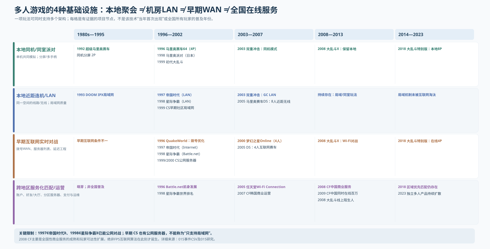

# 015 — 多人玩法的本地—局域网—互联网—全国服务化分代：同构体验，不同技术时代

- Status: **公开产业史研究；按“首次可行／跨区域可用／商业大众化／作者可负担”分账**
- Updated: 2026-10-10
- Cross-reference: [014 延迟补偿与网络架构](014-network-regime-latency-compensation-and-genre.md)、[008 游戏技术—产品分代图谱](008-audited-genre-capability-atlas.md)、[012 内容成本与独立多人](012-3d-content-contraction-and-indie-system-worlds.md)
- Primary observations: [015 21件按年、地理范围、产品社会服务的事件表](015-multiplayer-connectivity-experience-events.csv)
- Figure: [015 同一个玩法族的4条联网基础设施时间轴](015-multiplayer-social-geography-regimes.svg)

## 1. 本研究的修正：联网技术不是“2D→3D→MMORPG→MMOFPS”简单替换

必须增设**社交/物理可达范围（geographic/social reach）**轴，并与原 [014](014-network-regime-latency-compensation-and-genre.md) 的**同步算法/延迟补偿（netcode）**轴保持正交。还需要第三条**开发者可负担性（producer feasibility）**轴。

可以把看起来玩法相似的赛车/射击按实际技术生产体系拆为：

| 层级（同时可存在） | 同局/跨地域的可达范围 | 对玩家的体验形式 | 工程与商业条件 | 不能推定 |
|---|---|---|---|---|
| **LOCAL-SAME-MACHINE 同机聚会** | 同台机器／同室同一显示器 | 四手柄共享屏幕、分屏竞速、派对小游戏、自由乱斗 | 一份确定性/本机仿真，多输入、多摄像机/分屏渲染；无需公网延迟补偿与帐号后台 | 低技术水准；后来本地模式会自然消失 |
| **LOCAL-MULTI-DEVICE 近距离联机** | 同室多机、短距无线、联机线 | 多屏并行联机对战 | 基础通讯/局域同步、发现设备及安全接入；不承担全国路由质量 | 与同台共用屏幕是同技术 |
| **LAN-ROOM 局域网/网吧房间** | 同网段／机房、可靠低RTT，玩家线下聚集 | 机房FPS、RTS、局域赛事 | 每台计算机有独立同步状态、游戏协议、局域会话发现；技术上可采用客户端服务器或锁步等 | 同款游戏只可能在LAN运行 |
| **WAN-PIONEER 早期互联网服务器** | 不同地域经拨号/ISP公网连接；可连不等于稳定 | 服务器列表、指定房间、已有好友在公网PK | 抖动/丢包/延迟、预测回溯或低频锁步；用户懂得找IP服务器、配网络 | 公网FPS是2008 CF才发明的 |
| **WAN-SERVICE 区域／全国商用服务** | 全国不同城市可发现玩家并加入有运营的服务器体系 | 账户、好友/大厅、较低连接门槛、战绩/排位、举报/支付 | 区域机房与线路、登陆服务、组房/匹配、反作弊、客服、推广/网吧与平台渠道 | 全国所有玩家同延迟、所有匹配都是统一物理服务器 |
| **WAN-GLOBAL 近全球玩家生态** | 跨国家/洲服/全球排名，按地理/网络条件分区 | 全球用户池与分区匹配，跨区可能体验变差 | CDN/机房布局/跨区延迟/云/内容更新、法规运营；视具体游戏策略 | 全球用户=全球零延迟同场竞技 |

**同一产品横跨多列是正常现象**：1997 `Age of Empires` 支持LAN/Modem/Internet；2003 `Mario Kart Double Dash!!` 本机+GameCube LAN；2005 `Mario Kart DS` 8人近距无线 / 4人互联网；2018 `Smash Ultimate` 同机、近距无线和区域优先的互联网对战并存。**不应把“LOCAL、LAN、WAN”当互斥的顺序世代。**

## 2. Mario Party、Kart、Smash 为什么值得单列，而不是分类为“落后联网”

| 年份与项目 | 原作品使用方式 | 证据 | 为什么在行业分代中关键 |
|---|---|---|---|
| **1992** `Super Mario Kart` | 同机两玩家竞速/对战 | [Nintendo 系列历史](https://www.nintendo.com/jp/character/mario/en/history/index.html) | 需要低操作延迟和多人互动，但不需要互联网；本地竞争不是退化的互联网多人 |
| **1996-12-14** `Mario Kart 64` 日本首发 | N64单机4P；同机共享/分屏 | [Nintendo日本](https://www.nintendo.com/jp/character/mario/history/kart_64/index.html) 与 [Nintendo系列研发采访](https://iwataasks.nintendo.com/interviews/wii/mariokart/0/1/) | 玩法可以很即时而无需设计网络预测/跨区匹配 |
| **1998-12-18** `Mario Party` 日本首发 | N64同室派对小游戏与回合棋盘；北美1999上市 | [Nintendo 日版首发年表](https://www.nintendo.com/jp/character/mario/history/party/index.html) | 棋盘低频+小游戏高频共存，适配一台机器；2022 NSO模拟器支持联网不能追溯成1998原作内置网络 |
| **1999** `Super Smash Bros.` | 原始N64同屏2—4人自由战 | [Nintendo官方第一代作品页面](https://www.nintendo.com/en-gb/Games/Nintendo-64/Super-Smash-Bros-269756.html)／[岩田询问创作缘起](https://www.nintendo.com/en-gb/Iwata-Asks/Iwata-Asks-Super-Smash-Bros-Brawl/Volume-7-Once-in-a-Lifetime-Experience/1-Dragon-King-The-Fighting-Game/1-Dragon-King-The-Fighting-Game-226141.html) | 开发成本是多人动画/判定/角色平衡，而非公网网络工程 |
| **2003** `Mario Kart Double Dash!!` | GameCube共享同机体验+宽带适配器局域网多屏游戏 | [Nintendo UK原厂描述](https://www.nintendo.com/en-gb/Games/Nintendo-GameCube/Mario-Kart-Double-Dash--268269.html) | 同样赛车规则多出近距多机，不等于互联网提供全球对手 |
| **2005** `Mario Kart DS` | **8名玩家近距无线，4名玩家在线**（不能反过来） | [Nintendo 岩田询问制作人Konno](https://iwataasks.nintendo.com/interviews/wii/mariokart/0/1/)；[系列历史](https://www.videogameschronicle.com/features/the-complete-history-of-mario-kart-games/) | 这是**最优控制组：同一产品的近距/公网模式，人数不同**；开发者明确讨论龟壳等密集即时互动给网络带来的挑战。近距8P→公网4P，不是“2005年技术突然允许无成本8人公网赛车” |
| **2008** `Super Smash Bros. Brawl` | Wii继续本地多人，同时经Nintendo Wi-Fi Connection与好友/随机玩家对战 | [Nintendo岩田询问/樱井一手访谈](https://iwataasks.nintendo.com/interviews/wii/ssbb/2/0/) | 原有本地自由乱斗被重新工程化为在线游戏，同时增加社交发现限制 |
| **2018** `Smash Ultimate` | 同机最多8人 / 在线最多4人，互联网优先同区域匹配 | [Nintendo 官方对战规则](https://www.smashbros.com/en_GB/howtoplay/communication.html) | 连2018仍无法说“公网取代同室”；联网与本地支持人数及体验规则不同 |

**专门记录 Nintendo 的“玩家数量×连接范围”**，不仅记录发行年。按 2005 原版 `Kart DS`、2018 `Smash Ultimate` 官方数字，可用样本内反证“互联网连得越远，单位游戏就一定能容纳更多玩家”这样的想当然结论。产品本地与互联网人数不同也会受设计/服务决定，不能全部归因为带宽。

## 3. 早期 CS / RTS：LAN 经常是更好的体验，但已经存在 WAN

### 3.1 FPS 的“功能早已存在，公网体验很差，后来大众普及”三阶段

- **1993 `DOOM`**：LAN高频射击代表，也有Modem/直连等机制，不能简单标为LAN独占。[Gaffer技术史](https://www.gafferongames.com/post/what_every_programmer_needs_to_know_about_game_networking/)。
- **1996 `QuakeWorld`**：John Carmack在1996-08-02公开写道，原 Quake联网实现针对低于200ms，现实拨号用户常见300ms以上，开始改进预测/服务器模式/互联网游戏发现。[Carmack原始.plan文本](https://www.gamers.org/dEngine/quake/archive/a_july96/0000.html)。它证明现实公网高RTT需要独立系统工程，并不是直到 `CrossFire` 的2008年才让远程FPS成为可能。
- **1999 `Counter-Strike` 模组 → 2000正式版**：早期极具LAN/网吧场景优势，但**已经存在互联网服务器社区**。Steam当前保留的正式版[2000-11-01发售页](https://store.steampowered.com/app/10/CounterStrike/)称其为在线FPS。1999beta服务器和全球覆盖率尚缺统一分母：能公网联网≠那个时期中国任意两座城市普遍得到好延迟，更不能断言互联网是2008才有。
- **2007—2009 `CrossFire`**：2007-05韩国开服、2007进入中国、2008-07中国商用、2009-04中国同时在线100万的里程碑由[开发商Smilegate官方年表](https://m.smilegate.com/ko/company/history.do)与[2018回顾](https://newsroom.smilegate.com/eng/CrossFire_Records_as_Global_No_1_Online_FPS_Game_EN)给出。它代表中国更广泛普通用户的**组织化互联网FPS供给/大规模社交分发**，不是新发明客户端预测或服务器权威体系。
- Smilegate开发者回顾也提到与本地运营商合作、借QQ关系网获得用户，这意味着“全国找陌生人PK”的社会效率来自服务、分发与玩家密度，不只来自通讯算法。[Smilegate 2018年回顾](https://newsroom.smilegate.com/eng/CrossFire_Records_as_Global_No_1_Online_FPS_Game_EN)。

### 3.2 RTS不是“只能LAN”，其不同延迟预算恰恰让早期公网可行

- `Age of Empires` 1997：2001年程序员同期复盘称其从1996开始就把**LAN、Modem-to-Modem和Internet**设为8玩家/28.8kbps目标平台；通过交换命令和确定性游戏状态避免对全地图所有单位反复同步。原始说明详见 [Game Developer 2001](https://www.gamedeveloper.com/programming/1500-archers-on-a-28-8-network-programming-in-age-of-empires-and-beyond)。
- `StarCraft` 1998：暴雪原版手册按[公开FTP原始手册](https://ftp.blizzard.com/pub/misc/StarCraft.PDF)区分**Battle.net公网（2—8人）、LAN与Modem**，而Battle.net也提供聊天/排名/找对手。**审计边界**：FTP原始PDF网页在本轮检索中返回502，当前仅使用搜索引擎索引的原始手册摘录；文中字段标 `PRIMARY_MANUAL_INDEXED`，尚需扫描本地完整原版，不能当已逐页看完。补充[Blizzard官方Battle.net历史](https://news.blizzard.com/en-us/article/23583668/welcome-to-the-new-battle-net)。
- 不能仅用“网络距离”推断RTS/FPS的交互水平：RTS以数百单位的确定性状态/命令为主，局部延迟感知不同于FPS按每枪实时判定；并非早期网络只允许慢速RPG。文章中的“MMORPG因低频输入是唯一可做的mass online”可当**历史设计机会假说**，不能拿来否定早期公网FPS/RTS及在线协作例子。

## 4. 为什么同玩法的2000年CS与2008年CF仍应区分技术环境

| 可证维度 | `CS 1999/2000` 技术与体验环境 | `CF 中国2008` 服务与体验环境 | 判定性质 |
|---|---|---|---|
| 射击核心 | 3D FPS、快节奏即时瞄准 | 3D FPS、快节奏即时瞄准 | 玩法家族近似 |
| 客户端—服务器算法 | GoldSrc/Valve已有公网服务、运动预测/插值等成熟基础 | 商业客户端/服务器FPS，不是首次发明预测 | **技术原发期更早** |
| 公网进入门槛 | LAN/社区服务器/IP、地区与ISP质量影响显著 | 区域中心运营、QQ流量渠道、账号/大厅/组房 | **互联社会及商业服务组织升级** |
| 距离与网络条件 | 中国网吧LAN好体验不应被假定为同时代所有欧美地区唯一情况 | 全国用户来源/服务覆盖不等于全国任意两玩家共享零延迟 | 服务可达≠链路质量同一 |
| 商业运营生产 | 社区服务器/网吧联盟/Valve产品发行，各时代不同 | 出品商+中国代理大规模在线运营、活动、支付、客服、推广 | 制作一个网络游戏≠养成全国竞技服务 |
| 社会关系 | 同屋好友组队更常见的用户体验（具体比例仍未知） | 跨城陌生人可发现、用户池密度上升 | 人群普及规模需要区域使用者数据证据 |
| 可量化比较 | 当年在线/局域网活跃玩家分母待查 | 官方2009百万CCU（与早期CS比较要统一地区、统计单位） | **不允许用一例+一数字推全球市场份额** |

最精确的表述应是：
**“CS从一开始就不只是局域网游戏；但在中国的用户与线路条件下，早期CS常以网吧LAN呈现最佳体验，而2008后CF体现的是由运营商级服务、普及的接入网络及平台社交分发支撑的全国性互联网对战大众化。”**

不能写成「1999年互联网无法打FPS、2008年才有联网FPS」；也不该反过来拿一部QuakeWorld或早期CS公网服务器，就说1999与2008中国大众的实际可达人数、设备、付费、Ping/丢包、找到对手成本“没有数量级差距”。

## 5. 需要在主产业技术分代中增加两个成本钟

之前 [014](014-network-regime-latency-compensation-and-genre.md) 着重网络算法，同 [012](012-3d-content-contraction-and-indie-system-worlds.md) 手工内容负担并列时，仍缺：

- **同室本地多人的生产成本**：控制器/输入、分屏渲染、相机、近距离社交、现场多人测试；不需要网络身份/服务器、WAN丢包恢复、远程反作弊体系。
- **局域网/近距无线生产成本**：多机确定性、一致性、同步/协议、会话发现、独立设备和局域质量；不等于“互联网规模”。
- **早期WAN的技术风险**：公网带宽、调制解调器、抖动/丢包/高RTT、穿透/端口设置、客户端预测或锁步、模拟一致性、宿主服务器与作弊。
- **全国在线服务的补充组织成本**：机房/跨ISP线路/区域部署、账号、好友/匹配、平台用户获取、运维、反作弊、支付客服与发布，已不等于主要把同步代码写好。
- **普通小团队可承担的联网创作**：已有引擎和网络/平台服务使专业网络技术“继承/重组”成为可能，却不能免除实际线上测试与商业运营，也不等于2020年代才有个人联机游戏。

网络代际相关标签应由`interaction_scope`（shared-machine/local wireless/LAN/WAN/national/global）、`netcode_pattern`、`match_discovery`、`availability_in_region`、`market_adoption_evidence`、`production_organization_cost`分别承载。每个案例允许多标签，避免以“首年上网”定义当代产品全部技术。

## 6. 下一步的数据分母（用于判断真正技术普及而非只找到代表作）

1. **地域×年代**：1996—2010中、美、日、欧的宽带普及、网吧/家用接入、跨ISP RTT、玩家地区服务器部署与带宽成本。未取得分地区人群分母前，"中国早期只能LAN"须降级为区域用户常见体验观察。
2. **用户发现成本**：IP手工连接/社区服务器列表 → Battle.net/Steam/Nintendo WFC/QQ入口 → 平台好友组队与随机匹配；以有效找人成功率、等候时间和地区密度考察，而不以年代标签代替。
3. **同玩法同市场三时钟**：1996本地Kart→2003 LAN Double Dash→2005 Kart DS互联网；1999 Smash→2008 Brawl在线→2018 Ultimate；1999CS公网早期/网吧LAN→2008CF全国服务，必须分别标`技术提供年/可用率/商业规模`。
4. **开发主体与工具吸收**：同机游戏只需要单一模拟状态，网络游戏引入双向多机同步；2020年代三人联机游戏需要检测其真实服务器/中间件/长期维护和市场结果，再判断何时真正出现持续作者量产Q。

**底线：** 本文仅有 21 个公开作品与技术年锚点，已足以修正历史分类及设计分工，但不是对全国宽带、全部多人游戏数量和去重开发者的系统普查。案例实证与行业数量级不得互换。
