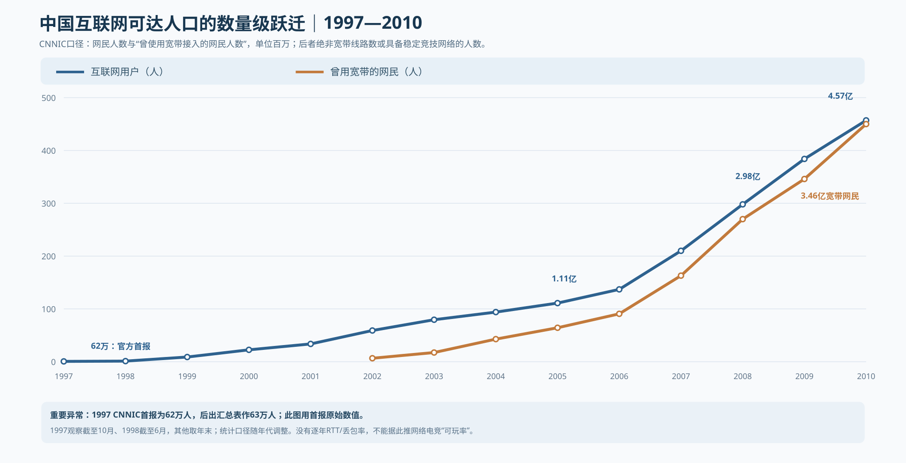
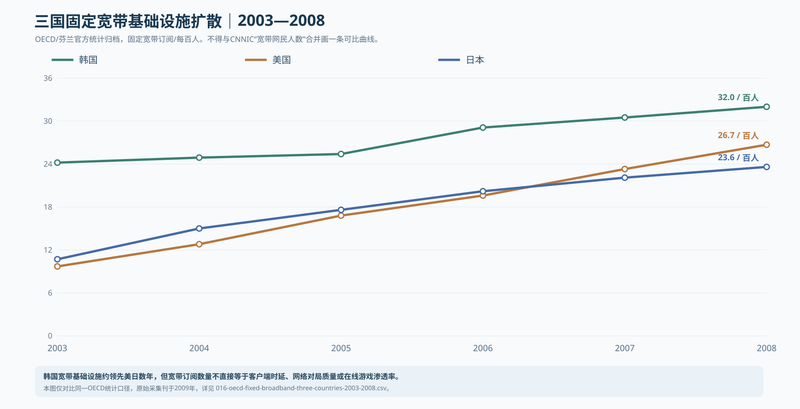

# 016 — 1997—2010 中国多人游戏实际可达性与跨国基础设施扩散：从网吧LAN到浩方全国连接，再到原生在线竞技服务

- Status: **QUANTIFIED RESEARCH / 部分指标已可画历史曲线，实际游戏RTT与玩家去重分母仍UNKNOWN**
- Updated: 2026-10-10
- Research lane: B, 公开游戏产业技术与商业史，不混入私人项目。
- 前文：[014 同步与延迟技术](014-network-regime-latency-compensation-and-genre.md)／[015 本地-LAN-早期WAN-全国服务化](015-local-lan-wan-national-multiplayer-production-regimes.md)／[012 独立多人生产力](012-3d-content-contraction-and-indie-system-worlds.md)。
- 数据：[中国网民与宽带网民1997—2010](016-china-internet-access-users-1997-2010.csv)（14行）、[OECD韩美日固定宽带2003—2008](016-oecd-fixed-broadband-three-countries-2003-2008.csv)（6年×3国）、[网吧/浩方/盛大/CF的服务、人口和运营事实](016-china-online-gaming-reach-service-evidence.csv)（16行）。
- 图：[中国1997—2010网民及宽带使用人群曲线](016-china-network-reach-adoption.svg)；[OECD2003—2008韩美日固定宽带三国曲线](016-oecd-three-country-broadband-adoption.svg)。

## 最重要的历史修正（比算法史更能解释中国多人游戏产业的兴起）

1. **“1999年CS只能在网吧LAN对战”是绝对化错误**。QuakeWorld 1996已有公网延迟工程；1997《Age of Empires》研发时就支持 LAN / Modem / Internet，1998《StarCraft》借Battle.net连接互联网玩家；早期CS互联网公共服务器也已存在。但各地区接入成本、丢包、运营商互联、搜索对手成本和用户密度不同，LAN仍可能是中国用户低延迟对战的优势体验。
2. **2005年，中国已经存在全国规模的通用PC联网对战/寻敌服务，不需等到2008年CF。** 盛大2005美国SEC年报证实，2005年完成收购浩方对战平台；平台使拥有LAN联网能力的PC游戏玩家能“通过互联网寻找并连接其他游戏玩家”，**当年浩方最高同时在线约535,000**。这比只讲《穿越火线》2008上线更有力，是本次发现的关键中间代际证据。[盛大2005 20-F, Network PC Games Platform](https://www.sec.gov/Archives/edgar/data/1278308/000114554906000926/h00616e20vf.htm)。
3. **2005年全国性网络游戏运营、付款与用户池能力已很大，不是CF的首创。** 同份SEC申报称盛大当年所有商业游戏**合计峰值同时在线2.68m**、平均**1.38m**，全国服务器的**宣称设计容量6.6m**、预付费卡渠道约**310,000个网点**。三组指标分别是**运营游戏组合真实峰值／平均值、宣称设计容量、物理零售网点**，不能相加，更不能等同同场RTS/FPS有效对手数；浩方535k为另一个平台统计，不能证明都是独立于盛大2.68m的额外用户。
4. **《穿越火线》在中国的差异是原生商业FPS把技术、服务器部署、玩家发现及持续运营打包规模化。** Smilegate韩语/日语原厂年表：2007-07进入中国市场、**2008-07商业服务开始**、**2009-04达1m中国同时在线**。英文年表把“1m”另在2008-07重复一条，同一公司不同语言的内部日期冲突需要明列；目前采用韩/日两版相互一致的2009-04，而不是将2008与2009同时宣称已无争议。[韩国原厂年表](https://www.smilegate.com/ko/company/history.do) / [日语原厂年表](https://www.smilegate.com/jp/company/history.do) / [英文冲突记录](https://www.smilegate.com/en/company/history.do)。
5. **大众可玩能力不只跟设备和每次输入毫秒有关，也跟可达用户池及社会分发有关。** 网吧、浩方、全国商业服务是三个不同组织层级，可长期并行：同一个玩家2008年仍可以**坐在网吧**，却在网上与不同城市的人打游戏。最初“网吧→家用宽带→全国游戏”的严格互斥时间阶段需要撤销。

## A｜中国网民及“宽带网民”人数的宏观扩散

来自CNNIC第一次至第27次调查的数据与历史归档；真实年度源值/来源链接逐行保存在[016 CSV](016-china-internet-access-users-1997-2010.csv)。

| 参考期 | 总网民（百万人） | 曾通过宽带使用互联网网民（百万人） | 使用限制 |
|---|---:|---:|---|
| 1997-10-31 | **0.62** | 未统计 | CNNIC**原始第一份报告写62万人**，后2010年代转引表写63万人；用原始首报，同时保存冲突 |
| 1999-12-31 | **8.9** | 未统计 | CNNIC第五次原始报告；另一些发布日汇总页的1999年4m是不同测量时点，不可随意合并 |
| 2000-12-31 | **22.5** | 未统计 | 当时宽带分子尚不足以形成连续可比统计 |
| 2002-12-31 | **59.1** | **6.6** | broadband persons，不是线路/家庭数 |
| 2005-12-31 | **111.0** | **64.3** | 在家/网吧重叠；不表示64.3m个无丢包公网FPS玩家 |
| 2007-12-31 | **210.0** | **163.0** | 区域/运营商/实际终端性能差异需另证 |
| 2008-12-31 | **298.0** | **270.0** | 2008年网吧调查取6月的2.53亿分母，不能与年末2.98亿混用 |
| 2009-12-31 | **384.0** | **346.0** | 使用过宽带的人数，不是宽带订阅数 |
| 2010-12-31 | **457.0** | **450.0** | 2010总人数CNNIC英文[Basic Data](https://www.cnnic.com.cn/IDR/BasicData/)；宽带网民450m见[2010国民经济统计公报](https://www.peoplechina.com.cn/document/txt/2011-03/23/content_345810_2.htm)，需保留来源及定义差异 |

重要口径：**CNNIC“网民”是过去半年使用互联网的6岁及以上中国公民（后期报告），其中“宽带网民”也是“曾使用宽带接入的受访者”**，不是中国电信独立的固定宽带订户数，更不等于可稳定玩竞技游戏的成年人。CNNIC 2010年6月调查中，运营商**宽带接入户数**是**113,017,000 户**，同期网民是**420,000,000 人**，本来就分属不同统计单位。[CNNIC第26次调查资料](https://tech.sina.com.cn/z/cnnic26/)。

总体互联网人口从**2005年1.11亿→2009年3.84亿（约3.46倍）**，宽带网民从**6430万→3.46亿（约5.38倍）**。这足以给全国联网游戏提供更大的潜在网络入口，但这不是对所有地区游戏同服实际Ping、玩家同时在线数或匹配时长的因果估计。

### B｜网吧不是在全国联网兴起时消失，而是从本地比赛场所变为全国服务的接入点

- CNNIC第22次（2008-06，用户总体**253m**）：**39.2%** 的网民在网吧上网，估计**99.18m**人；**74.1%**也在家上网。两项是多选，不可相加为113.3%。网吧网民中**24岁及以下占70.7%**，不是70.7%的中国年轻人都去网吧。[CNNIC第22次官方归档](https://www3.cnnic.cn/n4/2022/0401/c88-813.html)。
- 2009-12在家上网网民比例**83.2%**。[CNNIC第25次](https://www.cnnic.cn/n4/2022/0401/c88-808.html)。
- 2010-06在家上网比例**88.4%**、网吧上网**33.6%**，CNNIC仍把网吧作为规模庞大的场所，并不意味着其只提供LAN游戏。[CNNIC第26次](https://tech.sina.com.cn/z/cnnic26/)。
- 一份在2008年提交SEC的中国游戏企业交易文件，援引IDC称**2006年约41.7%的“网络游戏玩家”在网吧玩网络游戏**。[SEC 2008申报](https://www.sec.gov/Archives/edgar/data/1349507/000113717108000848/infocircular.htm)。这与2008CNNIC的39.2%分母不同：2006**网络游戏玩家**vs2008**所有互联网网民**，不能当成同一指标的下降2.5个百分点。

### C｜线路运营商的实际互联缺陷：有全国服务不等于全国平均PING达标

2008-06的[网吧电信/网通双运营商网络解决方案](https://net.zhiding.cn/network_security_zone/2008/0602/897468.shtml)明确提及，跨运营商访问游戏服务器可能很慢，网吧为了满足游戏需求要同时接电信和网通两种线路。其证据是**当期行业运维者观察**，不是全国抽样；说明同一年份之内的ISP跨网问题足以改变玩家有效对手池，而非仅取“当年有没有光纤”就定技术代际。

因此当需要把“全国找人PK”量化为真实可用性时，至少记录：

`year × origin_city × target_server_region × origin_ISP × target_ISP × mode × hour × RTT_median_ms × RTT_P95_ms × jitter_P95_ms × packet_loss_pct × matchmaking_seconds × session_failure_rate`

当前研究**无1995—2010统一抽样的这些数据**。不凭历史事件反推所谓“当时平均延迟200ms”“跨网平均500ms”。

## D｜国际比较：韩国与美国、日本的宽带先后期并不一致

选用一个时间完整、定义相同的OECD快照（芬兰官方统计局[2008 年表 4](https://stat.fi/til/tvie/2008/tvie_2008_2009-06-09_tau_004_en.html)），**固定宽带订阅数／100人口**：

| 年度 | 韩国 | 美国 | 日本 |
|---|---:|---:|---:|
| 2003 | 24.2 | 9.7 | 10.7 |
| 2005 | 25.4 | 16.8 | 17.6 |
| 2008 | 32.0 | 26.7 | 23.6 |

这能支持**韩国在2000年代初期的宽带订阅普及比美日成熟得早**，但不能直接推出韩国玩家技术能力一定更高、韩国网络电竞必然领先，尤其不意味着同一网络下韩国RTT/包损比美日更低。基础设施普及率属于条件变量；游戏设计、平台形态、付费模式、法规、玩家文化、PC硬件仍要单独比较。

**不可把CNNIC“曾用宽带者 3.46亿”除以人口和OECD“固定宽带订阅数/百人”画成同一曲线**：前者是人，后者是线路订阅，且包含家庭与机构连接，统计年代定义各异。图一、图二故意分开放置。

韩国 PC bang 的年度场所规模有公开学术文献引用KOSTAT 1996—2005调查，但尚未核定原始普查定义、证照与“PC room/Internet café”的同义关系。本篇暂不把不同定义下的商户数放入中、美、日统一量化图。

## E｜以中国在线PC对战史为案例的五条“生产与用户可达时钟”

| 技术与组织能力 | 代表锚点 | 能证明 | 不能证明 |
|---|---|---|---|
| **LAN即时对战** | 1993 DOOM LAN、1999 CS模组，中国早期网吧常用 | 游戏可在可控局域网络内实现多机实时战斗，低RTT环境下好体验 | WAN不存在、当代人人有低延迟家庭公网 |
| **有公网网络协议** | 1996 QuakeWorld、1997 AoE、1998 Battle.net | 专业开发者已能对付早期公网延迟和发现远方对手 | 当时中国所有城市玩家都能低成本、稳定连通 |
| **让LAN游戏进入全国玩家池** | **2005浩方平台53.5万峰值同时在线**；2005盛大收购和整合 | PC LAN-capable游戏通过全国第三方网络服务跨地域寻找/连接玩家 | 这些用户都在玩CS、都低Ping、全国每个ISP互通良好 |
| **全国运营在线游戏组合** | **2005盛大所有商业游戏共2.68m PCU、1.38m ACU**；同时声明6.6m全国网络设计容量 | 全国服务器/商业渠道/付费/客服组织已经形成，而非2008之后才出现 | 2.68m不是同一款FPS的一局规模，也不能和CF 1m直接当等价产品增长比 |
| **原生FPS大众全国服务与跨国发行** | CF2007韩服与中国市场进入、2008-07中国商业、2009-04中国单款1m PCU | 原生团队FPS叠加全国大用户池和代理运营扩散 | CF发明了公网FPS、所有地区自由匹配没有延迟障碍 |

**一个可能改变著作结构的发现**：浩方是“技术产品分代”的中间层——把已有局域多人游戏经验通过独立的网络/玩家发现平台扩展至全国用户池，**无需原游戏同时完成全国账户、机房与商业服务改造**。这与后来的MOD/多人中间件/Steam/UGC创作基座属于“继承既有生产资料让旧品类跨越能力门槛”的历史机制，但不能将浩方误认成支持所有局域网游戏并免去同步技术改造。

## F｜下一轮真正待采集的数据与负面案例（不要靠故事填空）

1. 全国通信接入**结构与价格**：1997—2010按省/市、家庭/网吧、拨号/DSL/专线、计算机拥有率、电信网通互联、家用宽带资费；CNNIC/工信部历史公报优先。
2. **网络质量**：保存同一年代跨城市/ISP RTT 及掉线/丢包历史记录，至少给出分布（median/P95）和同时在线/时间段，不用一家网吧经验概括全国。
3. **当年大众玩家发现成本**：PC室的手工找人 vs浩方/战网/QQ/CrossFire服务。记录匹配失败率/活跃房间密度和不同地域玩家池，公开数字不足时标UNKNOWN。
4. **产品/用户分母**：不仅要看CS与CF胜者，也需包含支持联网但人口稀疏或因跨ISP质量而失败的游戏、服务器运营退出样本。对“全国性大众化”设资格而不是只找一个CCU里程碑。
5. **行业主角是否转移**：2005盛大已有百万级在线运营但大量是MMORPG/休闲；2009 CF单款FPS达到百万级PCU，这是一种**网络服务能力向新的高频玩法品类迁移**，不是“2008才会跨城联网”。

**研究方法结论**：这轮已从“代表作品列点”推进到**网民基数、宽带接入用户群、网吧实际使用、跨国宽带订阅、运营商财报平台并发**五种可分母指标。还不能画1995—2010所有玩家游戏RTT／跨省随机匹配成功率/独立中小开发者多人项目数的真实连续曲线；图中不能插值填假数。
