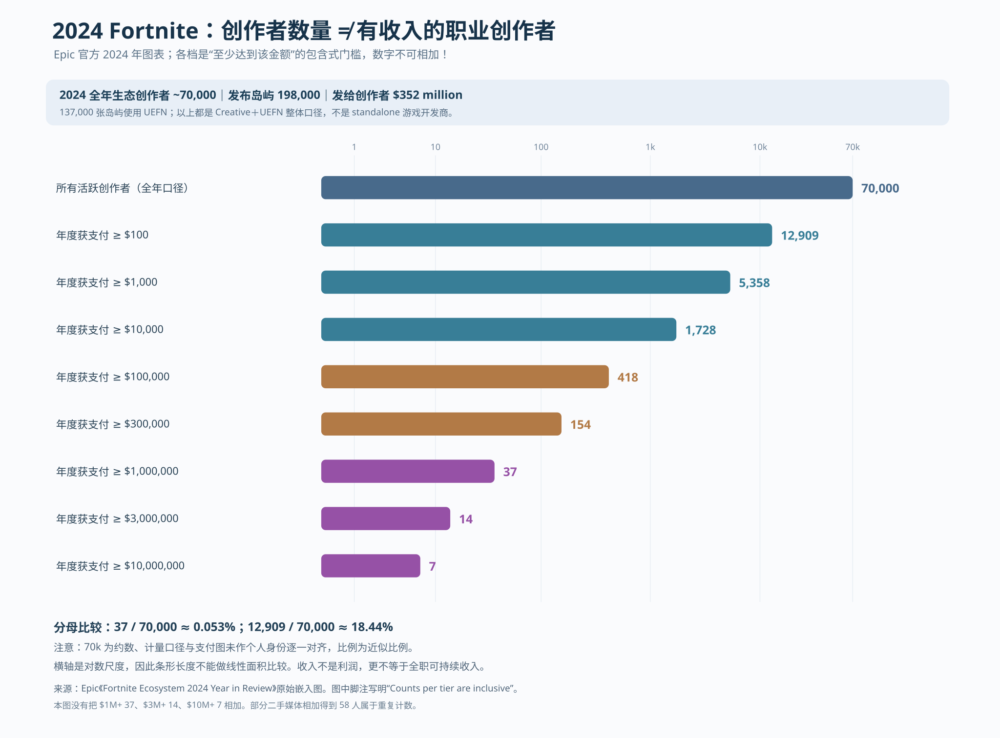
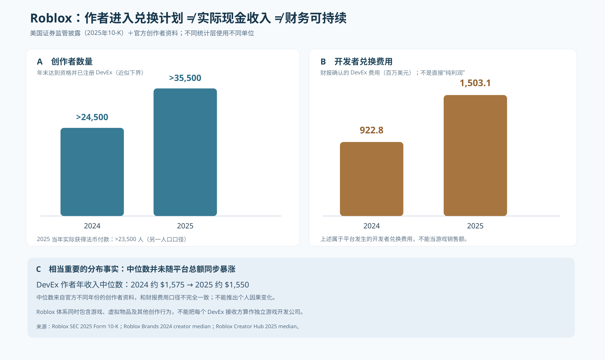

# 017 — 游戏作者量产的经济终点：Fortnite / Roblox 2024—2025 去重作者与真实支付

> **历史前驱补证：**[018 — 1981—1984 Atari Program Exchange（APX）作者出版/10%净额版税](018-cgw-apx-1982-publisher-vs-indie-evidence.md) 与 [019 — ZXDB 1980年代去重作者SQL/SQLite统计协议](019-zxdb-creator-cohort-protocol.md)。APX的目录存量不是现代开发者 ID 总数；ZXDB纯文本GitHub接口不能读取27MB压缩原库，**作者实数暂为UNKNOWN**。

- Status: **FIRST-PARTY PLATFORM EVIDENCE / 只证明平台作者量与收入分布，不证明 standalone 2D/3D 子类型的独立商业量产**
- Updated: 2026-10-10
- Canonical upstream: [008 2D/3D 技术—产品生产能力图谱](008-audited-genre-capability-atlas.md)
- Source scope: Epic Fortnite Creative+UEFN 全体创作者；Roblox DevEx 合格者／收款者；**是不同平台、不同计量和经济单元，不能直接混算**。
- Data: [作者量、门槛和资格 CSV](017-platform-creator-payout-cohorts.csv)／[财务口径金额 CSV](017-platform-creator-payout-totals.csv)。

## 1. 从“量产得出来”到“有收入”到底差多远？

[直接打开 017 经济漏斗图](017-fortnite-2024-creators-economic-funnel.svg)

2024年 Epic 对 Fortnite **Creative+UEFN 整个生态**公布 [70,000 creators、198,000 islands、其中137,000 UEFN islands、$352 million payouts](https://www.fortnite.com/news/fortnite-ecosystem-2024-year-in-review-celebrating-creators-and-looking-ahead)。此前 2023 年作者数约 24,000。以上同时提供**人数、生产条目数量、实际给创作者发放的金额**，是检验作者工具平台量产能力比“某年发售了一款产品”更有用的证据。

但真正关键的是 [Epic 原始年度收入人数图片](https://cdn2.unrealengine.com/fne-creator-payout-graph-jan2025-update-enus-1920x1080-ded4358ee38c.jpg) 角落明确写着：

> Creator counts per tier are inclusive and reflect actual 2024 payouts.

**必须按包含式累计门槛理解**，不可以将 `$1M+ = 37`、`$3M+ = 14`、`$10M+ = 7` 相加为 `58`。部分 [二手游戏媒体](https://www.pcgamer.com/games/fps/fortnite-has-58-creators-that-got-paid-over-usd1-million-in-2024-and-7-of-those-made-over-usd10-million/) 发生了这类重复计数，属于方法警报，**以原始图页脚为准**。

| 官方2024年累计门槛 | 作者数（达到该门槛） | 相对约70,000名当年生态创作者（推算） | 能证明的界限 |
|---|---:|---:|---|
| 所有被统计创作者（非付款门槛） | ≈70,000 | 100% | 2024年平台级创作群体（并非商业游戏公司） |
| ≥$100 | **12,909** | **18.44%** | 至少达年度小额支付门槛；不代表作者成本覆盖 |
| ≥$1,000 | **5,358** | **7.65%** | 付款规模变大，仍不代表职业收入 |
| ≥$10,000 | **1,728** | **2.47%** | 有较可观年度支付的作者人数；可能是团队 |
| ≥$100,000 | **418** | **0.60%** | 高收入但未扣成本 |
| ≥$300,000 | **154** | **0.22%** | 同上 |
| ≥$1,000,000 | **37** | **0.053%** | 百万美元级支付者数量，不是58人 |
| ≥$3,000,000 | **14** | **0.020%** | 是前一档37人的**子集** |
| ≥$10,000,000 | **7** | **0.010%** | 是前一档14人的**子集** |

解释比例时应写“约”：70,000是官方近似人数，按全体创作者作分母只是一项参考比率；门槛数据的资格人群、活跃定义未公布逐作者对齐，不是严格审计过的 cohort conversion rate。不能据 70,000−12,909 人推断一律赚不到 $100——他们可能不满足支付资格、未领取、处于结算期、低于门槛或仅免费创作。

**规模集中度的可靠下界**：2024年 $10M+ 的七位作者至少占全年 $352M 实际创作者支付总额的 $70M/$352M ≈ **19.9%**。只需官方金额和累计门槛，可算出此下限，但不能声称七人真只收到这70M，也不能推断收入的精确基尼系数。不能在经济图中把累计门槛加总。

## 2. Roblox：一手 SEC 披露如何把“人数”和“财务”分开

[直接打开 017 Roblox 资格／支出／中位数图](017-roblox-2024-2025-creator-monetization.svg)

| 项目 | 2024 | 2025 | 证据和不可混用的定义 |
|---|---:|---:|---|
| 年末已符合并登记 DevEx 的创作者 | **超过24,500人** | **超过35,500人** | [Roblox 2025 10-K](https://www.sec.gov/Archives/edgar/data/1315098/000131509826000024/rblx-20251231.htm)：**年底存量**，不是全年不同商业游戏作者 |
| 当年实际以法币通过 DevEx 收款的创作者 | UNKNOWN | **超过23,500人** | [Roblox 2025 10-K](https://www.sec.gov/Archives/edgar/data/1315098/000131509826000024/rblx-20251231.htm)：**全年收款者流量**；不能拿来和2024年末存量求增长 |
| DevEx 费用，财务报表列示 | **$922.821M** | **$1,503.106M** | [Roblox 2025 10-K](https://www.sec.gov/Archives/edgar/data/1315098/000131509826000024/rblx-20251231.htm) 的 developer exchange fees，**是财务费用，不是游戏GMV，也不等同某人的净利润** |
| DevEx 创作者年度收入中位数，官方营销资料 | **$1,575** | **约$1,550** | [Roblox 2024 统计](https://brands.roblox.com/resources/activating-on-roblox-the-virtual-economy)／[Roblox 2025 文档](https://create.roblox.com/docs/monetize)：**不同时间版本，可能存在定义差异，不宜声称平均作者收入下降** |

这表明在2024→2025，**有资格登记为收款者的作者规模显著增大，平台开发者兑换费用也增长**。但中位数仍在千余美元/年量级（官方营销口径），正好说明**“有人能靠游戏创作赚钱”与“多数创作者能靠平台完成职业生存”绝非同一命题**。Roblox 创作及DevEx类别包括游戏、头像/虚拟物品和插件等，**不能将23,500受款者划归3D游戏开发商**。

限定误差：Roblox **DevEx支付规则门槛**多次变化，2022年 100,000→50,000 Earned Robux，2023年50,000→30,000，因此注册作者数字受制度变化影响，不能全部归因“新工具提升了产能”。2025年换汇比例又从每Earned Robux $0.0035调整到 $0.0038；因此2024→2025金额比值混入平台收入、汇率、用户增长和创作者结构效应。

## 3. 如何反过来修正我们 2D／3D 的量产时钟 Q？

按三项**不互相替代**的作者能力定义：

| 阶段 | 能否量化 | Fortnite例 | Roblox例 | 结论 |
|---|---|---|---|---|
| **Q-A = publisher-ready作者人数** | 平台作者/发行者计数 | 2024年≈70,000名Creator | Roblox Studio作者全集未知 | 证明已有海量作者进入生产接口，**非某子品类量产** |
| **Q-M = monetized作者人数** | 同期**实际收入收取者**去重 | 2024年≥$100者 12,909人（官方包含式门槛） | 2025年实际法币兑换收款者 >23,500人 | 比地图数/注册账号数强，但商品类别混合 |
| **Q-S = sustainable作者人数** | 相同作者覆盖完整成本后的净回报与持续年份 | ≥$100k人数418只说明高额**支付**，不等于净盈利或长期职业 | 2025年收款中位数约$1550，非生计级收入 | **UNKNOWN**：需要成本、团队人数、跨年度存活和继续生产 |

对应本书原有Q1、Q2、Q3门禁：Q1（≥20独立作者同年同类完整作品）、Q2（连续三年且新作者进入）、Q3（商业可持续）**仍须逐品类/逐实体采样**。Fortnite在“平台广义创作者+支付”有数据，但**不能据此勾选某具体genre的Q1–Q3**。Roblox也一样。

因而现在可以画**平台作者经济漏斗**，而不能偷画“3D平台动作独立游戏每年赚钱开发者人数”的连续曲线。

## 4. 前 Steam 作者去重的真正破口：ZXDB，而非再搜历史名人

开源 [ZXDB](https://github.com/zxdb/ZXDB) 汇合 Original World of Spectrum、SPOT/SPEX/TTFn 等历史档案，拥有关系表 `entries`（作品）、`authors`（原始作者关联）、`labels`（人或公司）、`releases`（发行；`release_seq=0` 为原版）。其 [官方数据库模型](https://github.com/zxdb/ZXDB#database-model)、[辅助作者索引脚本](https://github.com/zxdb/ZXDB/blob/master/scripts/ZXDB_help_search.sql)、[官方SQLite转换脚本](https://github.com/zxdb/ZXDB/blob/master/scripts/ZXDB_to_SQLite.py) 提供真实做 1982—1992 ZX Spectrum **年×游戏类别×去重个人开发者**的基础。

**这是目前缺少 Q1/Q2分母的最直接解决方向，优先于继续搜1980年代著名程序员传记。** 执行需：

1. 固定 ZXDB 源数据库 ZIP 的版本/commit SHA，并用官方工具转换为只读 SQLite 副本。当前对话没有完整导入后的 ZXDB 数据库，**不声称已算出逐年独立作者数**。
2. 解析 `entries`、`releases` 原始发行年份及 `authors.label_id`，按**实际游戏 genre**筛出，排除工具、演示、书籍、合集、移植、再版（若原始 Spectrum 版本不等于原作品首次发行，另列PORT）。
3. 将 `labels` 区分个人、团队、工作室；**团队/公司作者ID不能冒充一个“个人程序员”**；未知类型列 `UNKNOWN_AUTHOR_TYPE`；多人参与的同作品贡献需要两个表：作品数和不同人名单。
4. 输出每年的作品总数、已知署名覆盖数、个人作者独立ID数量、其中多人协作作品比例、当年新作者率、作者跨年留存率，再按体育/平台动作/射击/角色扮演/策略等类别统计。
5. 与 [MobyGames前Steam收录快照](009-presteam-platform-release-observations.csv) 抽样交叉核查，但这两种资料有不同作品纳入边界，**不能擅自将两个库的产量相加**。

值得特别注意的是：ZXDB说明 `authors` 除 `label_id` 以外还会出现 `team_id`（见其 [help_search](https://github.com/zxdb/ZXDB/blob/master/scripts/ZXDB_help_search.sql)）；公司合作、署名归属的层级结构更复杂。只能在识别真实个人后做 Q-作者比例，不能把 `DISTINCT label_id` 无条件视为去重的作者人头数。

## 5. 研究方法修正与媒体转述错误

**第一个错误**：把 Epic 累计档位相加，重复统计37、14、7，甚至用“58个百万美元作者”证明更多量产成功。官方图右下角已经明示 `inclusive`。依据 [第一手图](https://cdn2.unrealengine.com/fne-creator-payout-graph-jan2025-update-enus-1920x1080-ded4358ee38c.jpg) 的37为正确数量，本库禁止拿二手58直接进表。

**第二个错误**：用 2024 Epic Creator 总人数直接除 Roblox 2025 DevEx 实付收款人数，推算不同平台谁更成功。这两者的程序资格、产品类别、年份、收费能力、支付门槛不同；顶多并行描述，不可组成同比图。

**第三个错误**：只计“挣钱作者”却不看**工资替代与成本覆盖**。一款好玩的UGC岛屿可以只有小额奖金、完全没有全职生产条件；长期经营型创作者也可能雇多人、购买内容与流量，一名 Creator ID 不等于一名员工。

**第四个错误**：GGJ历年公开统计也会有“活动结束即时报数”与数据库多年后回填的差异。如 [GGJ2025 即时公告](https://globalgamejam.org/news/thanks-making-ggj-2025-best-one-yet) 曾报告12,098个项目、35,371位参与者，而 [GGJ当前游戏年表](https://globalgamejam.org/games) 的2025可能回显12,059。对这类不同口径必须标 `snapshot_at`，不能混入准确的同口径时间序列。

## 6. 下一次可直接出图的量化课题

- **前Steam英国作者真正的Q图**：首选运行 ZXDB 整库分析，按**已知个人作者 ≥10/20/50**三个敏感性门槛画 1982—1992 的创作者数量，而非游戏总发行数。
- **Steam具体同品类Q图**：按AppID抓原始开发者和实际genre/2D/3D（帧/摄像机 + engine/tag + 编辑器工具），逐年去重单独统计2D平台、3D平台、俯视射击、FPS及合作生存；作者/工作室重复参与多个项目只计一次。
- **生产力的成本维度**：对历史同类项目按核心FTE×人月、外包与母组织提供的服务分摊，给出分布而非没有分母的个案平均值。
- **平台Q-S生存队列**：假设2023、2024、2025年作者有稳定Creator ID，交叉分析三个年度真实收入、净投入与复发行，才可确定有多少独立作者构成长期可持续的生产者阶层。
