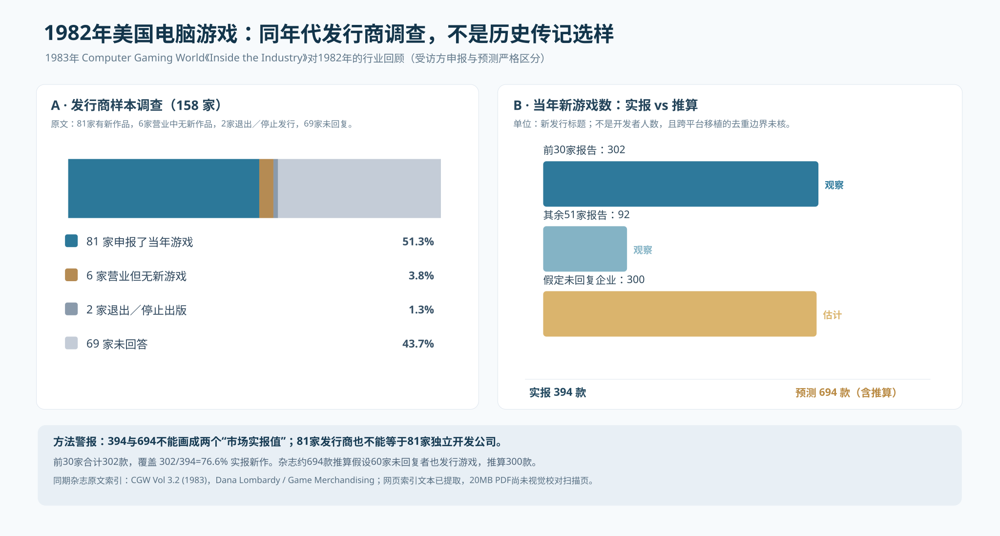
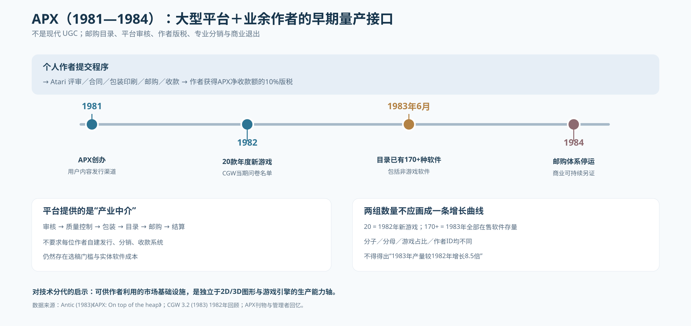

# 018 — 1981—1984 原作者生产、发行商分母与 APX：比 Steam 更早的游戏创作者产业

- Status: **PUBLIC HISTORICAL EVIDENCE / contemporaneous sample, not total author census**
- As-of: 2026-10-10
- Linked: [008 产业技术—产品能力图谱](008-audited-genre-capability-atlas.md)，[017 创作者与收入](017-creator-economy-economic-viability.md)
- Charts: [1982 受访者/新游戏统计及外推分离](018-cgw-1982-observed-vs-estimated-publishing.svg)；[APX 创作者商业接口阶段](018-atari-program-exchange-1981-1984.svg)
- Raw rows: [CGW 1982 30发行商新游戏数](018-cgw-1982-publisher-annual-releases.csv)，[CGW调查分母](018-cgw-1982-publisher-survey-denominators.csv)，[APX经济与年份](018-apx-creator-platform-supply-records.csv)

## 1. 1982年度同年代发行商调查：可观察到“许多不同发行主体”，但尚不能算作者

1983年美国游戏行业杂志 *Computer Gaming World* 第3卷第2期 `Inside the Industry`（Dana Lombardy / Game Merchandising）报告：对1982年电脑游戏软件发行商询问后，**81家当年有新作、6家尚营业但没有新游戏、1家已停业、1家已停止发行游戏、69家未回复**；按这5档相加，问卷总体158家。81家报告的全年新作**394款**（只是参与问卷样本）；文章另外假设69家未回应中有60家也有新作，每家约5款，则推估增加300款，得出**694款**。

整理文章列出的“前30名”，实报新作**302款**；其余51家实报**92款**。Top30/observed=302/394=**76.65%**。Top10实报160款，占394的40.61%；若以作者预测694作分母，约23.05%，这两种比例必须注明分母而不可挑最好看的数字。

**直接检验：**
- **81个有新作的发行实体**：至少当时已能观察到多发行商电脑游戏产品供给；这是市场组织规模分布，不是零星英雄案例。
- **394款报告新作**：报告中以当时发行目录口径列作品；尚未核移植、重复平台、系列版本等，不能认作394个独立开发项目，更不能当作394位作者。
- **694款预测总量**：建立在未回复企业产量假设上；**不是观察值**，图用异色、CSV用 `imputed_additional_games` 表明。
- 这一问卷涉及美国电脑游戏发行生态；与英国 ZX Spectrum 的1982收录90条（MobyGames）**地域、平台、目录、游戏分类不一致，绝不能合并也不能作美国/英国谁高的结论**。
- **同时代出版方并不等于当代意义下的独立工作室**：同一家可能是发行/平台方、许可代理或自研；同一开发者可供多发行商，必须追踪`developer/credited_person`。

原刊扫描：[CGW 3.2 (1983)](https://www.cgwmuseum.org/galleries/issues/cgw_3.2.pdf)；[另一个扫描副本](https://mirrors.apple2.org.za/ftp.apple.asimov.net/documentation/magazines/computer_gaming_world/Computer%20Gaming%20World-1983_0304_issue9.pdf)。**来源状态限定**：文字来自两份扫描的可搜索原刊索引文本，本轮 web PDF 阅读因20MB+限制未能查看扫描截图；尚未逐页人工复核。因此标 `CONTEMPORANEOUS_INDEXED_PDF_NOT_VISUALLY_CHECKED`，不伪称已完成原件页图审计。

## 2. APX（1981—1984）：比 App Store 早约四分之一个世纪的作者发行接口

真正重要的是 Atari Program Exchange 的**行业组织结构**：

- **1981**：Atari通过 APX 征集外部用户制作的软件，作为邮购/目录的补充供给；有官方 [1981年起历季原始目录](https://www.atariarchives.org/APX/catalogs/) 及 [初版用户手册/协议](https://www.atarimania.com/documents/apx-submission.pdf)。
- **1982**：CGW上表的 APX 名下新游戏20款。这只是当年CGW的**游戏问卷口径**，不等于APX该年所有作者发布的全部软件数量，也不是20名不同作者。
- **1983年6月**：[Antic](https://www.atarimagazines.com/v2n3/apx.html) 同时代文章指出 APX **目录超过170种产品**，其中既有游戏也有非游戏软件；大量产品由用户、其中不少业余爱好者制作。**170+是库存规模，不是1983全年新增游戏数**。
- **作者收入**：同篇Antic的规定为**APX所得净额的10%版税**，不是售价10%也不是开发者净利润10%；Atari担任制作、审校、实体包装、订购/分发、结算等中介。1982合同亦有 [原件](https://www.atarimania.com/documents/apx-submission.pdf)，其详情需视觉核原稿。
- **1984**：APX邮购模式终止，部分后续作品由Antic等接续。2000年 [APX主管Fred Thorlin一手回顾](https://www.atariarchives.org/APX/thorlininterview.php) 可证实运营组织与历史边界。回忆中的“50+ staff”是**平台支撑组织的历史规模，不是任何一款作者游戏的开发组人数**。

因此 APX 的正确编码是：
`platform_sponsor=LARGE_ATARI`，`individual_author_access=OPEN_SUBMISSIONS_REVIEWED`，`distribution=POSTAL_CATALOG`，`production_support=PLATFORM`，`payout_basis=10_PERCENT_APX_NET_RECEIPTS`，`yearly_unique_author_count=UNKNOWN`。

## 3. 与后来的网络UGC／数字发行有相似机制，但不能同曲线统计

| 能力层 | APX 1981—1984 | 后来 Steam/itch/GameMaker/Roblox/UEFN | 不能直接倒推出的结论 |
|---|---|---|---|
| 作者可提交 | 需要审核的邮购发行商 | 有不同平台/工具上架资格 | 提交者人数、被拒率未核 |
| 玩家入口 | Atari已有用户＋邮购目录 | 算法商店、线上分发、已有平台玩家群 | 渠道不等同 |
| 商业分账 | APX净收款10%版税 | Steam抽成、UEFN engagement payout、Roblox DevEx皆不同 | 单看百分比无可比基础 |
| 技术供给 | Atari 8-bit 硬件/文档 + 作者自研 | 标准化编辑器、服务器、商城、素材库 | 既有平台不能自动替独立作者做产品 |
| 平台寿命 | 约3年后邮购体系关闭 | 后继平台表现有差异 | 成功供给不保证平台经济可持续 |
| Q作者量 | 可证有多作者投稿、但暂无逐年精确去重 | Epic 2024广义作者量有70k，同品类仍待去重 | 170件产品不可认作170位开发者 |

**新历史命题**：作者生态的扩散可能由“出版与支付接口”先推动，而非先由图形引擎、算法、AI带动。1980年代的独立作者并非都“自己开发一个发行平台”，不少作者在享受大公司提供的出版技术。在“新技术降低制作门槛→出现更多独立作者”之外，必须单独画 `market_interface_access` 与 `publisher_substrate` 两条路径。

## 4. 原始档案年度作者数现在应如何查证？

- [019 — ZXDB关系库作者统计可复现提取方案](019-zxdb-creator-cohort-protocol.md) 与 [独立抽取程序](019-zxdb-annual-author-cohort.py)；
- 当前无法仅通过 GitHub 文本连接器获得原始 ZIP（二进制27MB）；作者人口数量依然 **UNKNOWN**，不得把上述81家发行商或170目录软件填入ZXDB`distinct_people`。
- 待得到可重现的ZXDB作者/作品映射后，再研究**作者群Q1≥20人/年、Q2连续三年、Q3商业净收益**；本轮 CGW/ APX 所证实的是较早时期 `Q_publisher_and_market_interface` 与 `Q_catalog_supply`，不等于 `Q_indie_author_confirmed`。

## 5. 方法纠错

1. 文章所说的“公司”与游戏开发者团队不可一一对应；
2. 同一产品移植/多个发行商可能重复出现（尚未去重）；
3. **预估的694不能和实报394混成历史年度产量**；
4. APX的1982新游戏20件与1983可售软件170多件不是同比；
5. 第一手受访编辑发出的统计可证明1982存在生产网络，不能证明1982个人作者就能开发当代规格3D作品；
6. 历史技术供给、作者生产可行、生态量产和作者可持续获利必须四轨分开。
