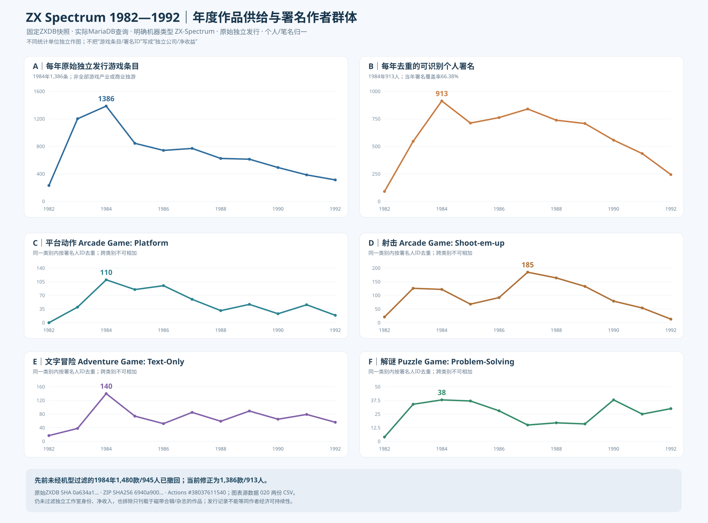

# 020 — 1982—1992年 ZX Spectrum 游戏产出与个人署名者：首次真实全库复算

- Status: **EXECUTED & MACHINE-FILTERED SNAPSHOT / 经固定源文件计算；不是独立工作室及商业可持续量产统计**
- Date: 2026-10-10
- 领域：《独立游戏英雄传说》公共产业研究；不涉及任何其他项目。
- 数据源：[zxdb/ZXDB](https://github.com/zxdb/ZXDB)，Einar Saukas等汇编、[ODbL](https://github.com/zxdb/ZXDB/blob/master/README.md)；固定源提交 [0a634a1165bd3690ea24e3c6b67bbbbb1b1ebd09](https://github.com/zxdb/ZXDB/tree/0a634a1165bd3690ea24e3c6b67bbbbb1b1ebd09)。
- ZIP：`ZXDB_mysql.sql.zip`，压缩字节 27,036,060，SHA256 **`6940a90091eb2f78700c4674a79c442bb480058cf09a757e85b860ff93068ee6`**。
- 复算：[GitHub Actions #38037611540](https://github.com/TrojanFighter/IndieGameLegendaryHeroes/actions/runs/38037611540)，已完成 **success**；有该次运行 [Artifact CSV/机器表/genre表](https://github.com/TrojanFighter/IndieGameLegendaryHeroes/actions/runs/38037611540#artifacts)（Artifacts 保留期有限）。
- 源码：[020-zxdb-live-mariadb-census.py](020-zxdb-live-mariadb-census.py) 和 [.github/workflows/zxdb-historical-author-census.yml](../../.github/workflows/zxdb-historical-author-census.yml)。
- 已落库静态核验数据：[020 — 11年年度 cohort CSV](020-zxdb-1982-1992-yearly-credited-people.csv)；[020 — 4个原始类型44行数据 CSV](020-zxdb-1982-1992-four-genres.csv)。

[单独打开六联年度图](020-zxdb-1982-1992-six-panel-author-supply.svg)

## 1. 这次是数据实算，不是从几十个成功案例推断

截至本轮，ZXDB入库由GitHub Actions执行：下载固定原始SQL ZIP、核27,036,060字节和SHA256、导入临时MariaDB、查询游戏分类/机器类型/原版日期/作者关系，并将可复查CSV和源SHA上传为Action artifact。运行时数据库只在临时环境使用，不把27MB原始档案提交研究库。

正确口径：`genretypes.text` 含独立单词 `Game` 的 **32** 个历史类别（**需后续逐类别人工确认，称 GAME_KEYWORD_PROXY**）；机器类别严格满足 `machinetypes.text LIKE 'ZX-Spectrum%'`，对源码参数化SQL的通配符必须写 `%%`；原版 `releases.release_seq=0` 且有1982—1992实际日期；署名 `labeltype_id='+'` 才可认作人，`'-'` 笔名只能映射到确认为人的 `owner_id`，公司和未解析名称**不计作个人**。

**重要：ZXDB还包含ZX81、Sinclair QL、Timex、SAM等机器**，初次执行漏了机型过滤。初跑#38037238473给出1984年 **1480条/945人**，属于不正确的ZX-Spectrum口径，**已经在本研究撤回并改为1984年1386条/913人**。第二次运行#38037529127因PyMySQL中SQL `LIKE 'ZX-Spectrum%'` 与参数替换的百分号冲突失败；第三次#38037611540修复 `%%` 后成功。不要再引用第一次图表数据。

## 2. 全部11年实测数

| 年份 | 有原始独立发行日期的游戏条目 | 当年可识别去重个人署名者 | 游戏条目中至少有一个可识别个人署名的比例 |
|---:|---:|---:|---:|
| 1982 | 232 | 91 | 47.84% |
| 1983 | 1,202 | 546 | 55.32% |
| **1984** | **1,386** | **913** | **66.38%** |
| 1985 | 845 | 712 | 68.40% |
| 1986 | 742 | 762 | 79.78% |
| 1987 | 771 | 840 | 82.75% |
| 1988 | 625 | 738 | 82.08% |
| 1989 | 614 | 708 | 83.06% |
| 1990 | 493 | 557 | 80.53% |
| 1991 | 386 | 435 | 82.64% |
| 1992 | 313 | 244 | 79.87% |

表中两个数量的单位不同：一个项目可有多个作者、一位作者可参与多个项目。这并不是“人均生产率”或“平均团队人数”。已归档项目且有日期才可能进入样本，未署名不等于作者为零；不同年份的作者署名覆盖率差异很大，**不能把原始人数曲线不经修正就读作市场总供给曲线**。

1984年共1,386条符合日期和机型范围的条目，920条至少有一个可识别的人名，另有524条有未解析作者信息。后二者可以重叠，**不能920+524来算总作品数**。全库当年去重913名已知个人，其中717人是本1982起样本窗口内“首次观察到”；这绝不等于第一次进入游戏行业。

## 3. 同类品类供给：已经能分 genre 真正画图

| 原始ZXDB分类 | 1982署名人 | 1983 | 1984 | 1985 | 1987 | 1992 | 连续的≥20人/年观测窗口 |
|---|---:|---:|---:|---:|---:|---:|---|
| `Arcade Game: Platform` | 0 | 40 | **110** | 85 | 60 | 19 | **1983—1991**（9年） |
| `Arcade Game: Shoot-em-up` | 21 | **126** | 122 | 68 | **185** | 13 | **1982—1991**（10年） |
| `Adventure Game: Text-Only` | 17 | 38 | **140** | 74 | 85 | 56 | **1983—1992**（10年） |
| `Puzzle Game: Problem-Solving` | 4 | 34 | 38 | 37 | 15 | 30 | **1983—1986**（4年），**1990—1992**（3年） |

以上人数按**每一个原始genre内部**去重；一名作者可出现在两个genre里，**不同genre人数不得简单相加**。另外历史的 `Arcade Game: Platform` 不等于今天所有Steam `2D Platformer` 标签作品，`Shoot-em-up` 不是现代单一“俯视射击”类型；这是 ZXDB 历史分类，不是由视觉图像判断出的固定2D/3D同保真对照。

即使把阈值提高到每年**≥50名明确个人署名者**，原始平台动作 1984—1987连续4年，射击1983—1991连续9年，文字冒险1984—1992连续9年。但这只是“**被记录署名的个人作者 cohort proxy**”，不能反推每人对作品拥有发行/预算主导权。

## 4. 怎样使用这些数量回答“大、中、独立的游戏生产能力”

已可推定：至少在 ZX Spectrum 历史档案中，平台动作/射击/文字冒险并非由一两个个体偶发生产，多个年份具有数十至百余名**可识别贡献者**，并可按同一类别观察持续多个年份的人群规模。

仍不能推定：
- 1984年913人都是相互独立的工作室/自雇作者；
- 1984年1,386个原始独立发行条目就是1,386个付费商业首发；
- 1984年全部作者都有职业收入或盈利；
- “一人署名的作品”确由一人完成所有程序、美术、QA；
- ZXDB 和 [CGW1982美国发行商](018-cgw-apx-1982-publisher-vs-indie-evidence.md)、[MobyGames旧平台索引](009-presteam-platform-release-observations.csv)、[SteamDB当代标签](006-annual-observations-dictionary.md) 能直接加总。

特别重要的是：**这次机器型号过滤后，1984年仍有913名可识别署名者，但只对1,386条中的66.38%有已识别人名**。如果判断全行业真正作者量（包括无姓名记录），仅凭所见真实人头未能建立统计学置信区间，也不能根据已署名游戏直接比例外推没有缺失偏差的总人头。

## 5. 同类长期量产门禁和下一步真正要补什么

- **Q-proxy (credited humans)**：可从这次11年原始数据库读出≥10/20/50的持续年度区间；已初步建立，对平台动作、射击、文字冒险可以连年观察到多个主体的人头。
- **Q1-confirmed indie entities**：至少20个**独立主导开发实体/团队**同年完整产品；本次数据 **UNVERIFIED**，需查发行身份、作者所属、合著者、承包关系、版权、售价。
- **Q2 3-year independent cohort**：需在 Q1成立的基础上验证不同独立实体跨年/新入场；目前 **UNVERIFIED**。
- **Q3 commercial repeatable viability**：要看出售/版税/成本、后续作品与平台支持，均 **UNKNOWN**，可按 [APX1981—84作者出版模式](018-cgw-apx-1982-publisher-vs-indie-evidence.md) 建微观案例后再扩样。
- 下一轮还需加带原始日期的**杂志type-in与cover-tape首发**；当前只看standalone的原版，可能漏掉许多卧室/业余作者。并把人员角色映射到编码/美术/音乐/策划，再区分产能和“有署名的受雇贡献”。

**当前最大的实质进展不是找到了最早一个人做2D/3D的故事，而是在固定档案和明确分母下首次建立了1982—1992年11×多个同类品类的实际可审计作者群数量图。**
