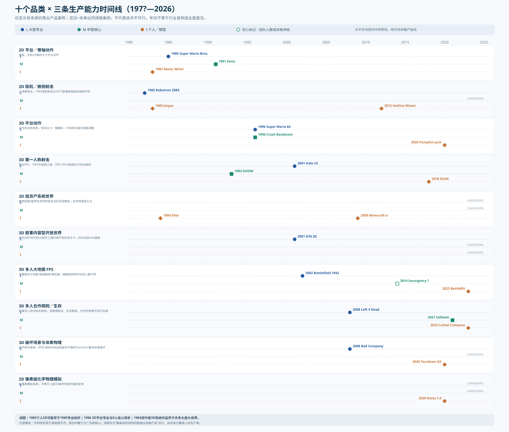

# 021 — 先看这三条线：分品类 L／M／I 生产能力时间轴（1980—2026）

> **当前优先阅读：**[023 — 1958—2026游戏分品类L/M/I三条线的标志性历史作品总览](023-first-readable-historical-three-line-atlas.md)｜[可直接观看的主图SVG](023-representative-three-rails-filled-first-pass.svg)｜[65条来源可追的里程碑记录](023-representative-genre-three-rails-1958-2026.csv)。[022](022-network-conditioned-genre-three-line-method.md)的102格是科研审计辅助，不是主图完工条件；现主图9家族×3轨，有27/27已有案例锚点。联网以S/C/N/O/D/∞模式注释，工具和不同子品类合作列附轨。

> **2026-10-10 已降级为历史草稿：本页旧图混合不同联机架构、人数与非同类合作玩法，请改以 [022统一品类×网络条件方法](022-network-conditioned-genre-three-line-method.md)、[102格系统矩阵](022-genre-network-lmi-matrix.svg) 与 [21单元三轨时间轴](022-network-conditioned-three-rail-timeline.svg) 为准。** 特别禁止把Left 4 Dead / Valheim / Lethal Company画成一个严格的三阶段品类，禁止用Stardew 2016单机作者证明2018联机功能是独立完成。

- **地位：本系列的读者第一入口。** 005—020为历史证据库，不再让ZXDB作者总数、Steam标签、UEFN创作者经济覆盖本题主体。
- Status: **DATABLE PRODUCT ANCHOR MAP**，不是全产业确证的首次年份、成熟产量曲线或每年人均生产率。
- Source: [24条「品类×组织形态×年份×案例×规模×发行支持」CSV](021-genre-lmi-three-line-anchor-evidence.csv)；[十品类三线时间轴 SVG](021-genre-three-production-lines.svg)。

## 1. 到底要回答什么

**在同一个品类和目标制作规格中，对三种生产主体分别求出「哪一年已能商业交付」和「何时变成普通能力」：**

- **L / 大型专业体系**：主机平台方、专业大厂/高资本公司/专用硬件及其完整生产与发行支持。**注意大公司发行不等于大项目开发核心**。
- **M / 中等开发核心**：优先记录5—49名实际项目核心制作人员，人年/外包另计；必须写明是企业内部小组、独立专业公司还是受巨大发行商支持。不得把小核心直接写成「中厂无需大组织支持」。
- **I / 个人或微型独立作者**：个人/约2—4名创作核心主导完整商业作品，必须揭示发行商、外部美术音效、免费现有引擎/服务器的隐含生产条件。

完整数据库以 `genre_id × target_fidelity × release_scope × calendar_year × organization_track` 为主键，同时另设 `genre_first_observed_anchor_year`、`genre_repeatable_period`、`genre_independent_commercial_production_cohort`。**这三条线是每个品类三个独立年份坐标，不是先大后中再小的预设路径。**

### 产品案例优先表（年份均为案例，不宣称行业首例）

| 品类 / 技术规格 | L专业大组织 | M中等核心 | I个人或微团队 |
|---|---|---|---|
| 2D 卷轴平台 | 1985 Super Mario Bros. | 1991 Sonic 初期5→7人；**Sega内部** | 1983 Manic Miner |
| 2D 街机/俯视射击 | 1982 Robotron 2084 | **UNKNOWN** | 1983 Jetpac（Stamper兄弟）；2012 Hotline Miami（两人，但规格提高） |
| **3D 平台动作** | **1996 Super Mario 64** | **1996 Crash Bandicoot（8人核心）**、索尼/Universal发行支持 | **2020 Pumpkin Jack**个人主导；另有2017 A Hat in Time独立团队但核心人数待核 |
| 3D FPS | 2001 Halo（Microsoft/Bungie生产发行体系） | 1993 DOOM，初期约5人核心、后来多人员参与且自制引擎 | 2018 DUSK 作者型、新血发行 |
| 3D低资产系统世界 | **UNKNOWN（同规格）** | **UNKNOWN** | 1984 Elite双作者线框模拟；2009 Minecraft alpha个人起步 |
| 3D手工内容开放世界（2001规格） | 2001 GTA III | **UNKNOWN（同规格）** | **UNKNOWN（同规格）** |
| 3D大型多人FPS | 2002 Battlefield 1942 | 2014 Insurgency为**中型候选，尚无当年确证人数** | 2023 BattleBit Remastered约3—4人，报道口径有差别 |
| 3D多人合作（宽口径技术体系） | 2008 Left 4 Dead | 2021 Valheim 5人团队，Coffee Stain发行 | 2023 Lethal Company Zeekerss个人；**合作生存≠合作恐怖** |
| 3D场景可破坏 | 2008 Battlefield: Bad Company Frostbite | **UNKNOWN** | 2020 Teardown EA微核心；**网格战场破坏≠体素破坏，不能称同规格复现** |
| 2D像素级化学与物理模拟 | **UNKNOWN** | **UNKNOWN** | 2020 Noita，Nolla Games 3位核心；自研物理引擎 |

## 2. 立即能读出的非线性演化

**（一）1980年代2D：I 不必晚于 L。** 小作者商业 2D平台《Manic Miner》1983，与主机高规格标杆《超级马力欧兄弟》1985并存。该两个年份并非各自历史初例，证明只在**跨规格**对照时I能显得更早；真正等规格比较须看同年内容、画面、关卡、发行范围。1983《Jetpac》由Stamper兄弟编程/画面协同，原始档案可查售价/出版。([World of Spectrum](https://worldofspectrum.org/archive/software/games/jetpac-ultimate-play-the-game)，[计算史博物馆](https://www.computinghistory.org.uk/det/32829/Ultimate-Play-The-Game/))

**（二）1996年3D平台：L 与 M 可以同步。** Nintendo的《超级马力欧64》与Naughty Dog的《古惑狼》同年上市，后者团队最大8人。它不是“1996年只有任天堂有3D平台产品，2017年才轮到中厂”，而是当年已能凭少量核心开发人员交付商品级3D平台作品，只是索尼发行、主机SDK等外围依赖不能删除。([Naughty Dog 官方回顾](https://blog.playstation.com/archive/2014/12/03/naughty-dog-looks-back-20-years-playstation-development))。独立作者型高完成度三维平台《Pumpkin Jack》到2020年可实证；1996→2020 **24年仅是所选两例的年份差，绝非真实行业扩散必经24年**。

**（三）FPS 不是大组织掌握以后中小作者被动学习的单链。** 1993《DOOM》本身就是5人起步、后增支持成员的专业创业队伍**主动创造**出技术突破；2001《Halo》则是更后期的专业资本/平台规模产品。2018《DUSK》又是个人主导借成熟工具重现另一种目标规格的FPS。这里L/M/I按**组织规模和生产支持**看，而非发明者按年从大型向个人传授技术。([DOOM Team and Tools](https://disciplinas.uvv.br/assets/games/gebbdoom.pdf)，[DUSK Steam开发/发行主体](https://store.steampowered.com/app/519860/DUSK/))

**（四）开放世界必须按资产保真切断比较。** 1984双作者《Elite》只在当时的线框贸易模拟规格证明个人商业系统世界可行；它没有证明同两个人能完成2001《GTA III》的完整3D城市资产、AI/任务/配音/演出。同样早期Minecraft证明体素系统沙盒个人起步，不证明AAA城市开放世界被微型团队做完。([Ian Bell Elite](https://www.elitehomepage.org/))

**（五）破坏物理存在架构换道，而非等引擎下沉。** Frostbite 2008的商业大厂战场破坏，与2020《Teardown》小团队体素模拟结构不同；2020《Noita》三人2D逐像素化学引擎更是横向取巧和自研的并行路线。不能把Noita和Teardown当成谁先谁后的同一种技术。([Teardown发售时间](https://store.steampowered.com/app/1167630/Teardown/)，[Nolla官方制作组](https://www.noitagame.com/press/index.html))

## 3. 图表与证据的解释规则

**实心点**：确认项目真实存在、年份和组织/核心角色的至少一个明确证据；**空心点**：如2014 Insurgency中型规模尚缺项目人员证据。**未绘制 / UNKNOWN**：缺同档可核商业案例，不等于该年份技术不可能。横向细线仅为时间坐标，**不是一旦出现便此后所有相同规模制作团队都能交付的持续生产曲线**。

**M的含义要清楚**：Sega的7人小组、Naughty Dog的8人核心与Iron Gate的5人独立公司是**不同生产组织**，要在同一图层用 `corporate_internal`、`independent_with_publisher`、`independent`分别编码；任何跨年度人数比较都需项目核心FTE、外包及集团支持。出版公司支持不否定创作独立，但影响可负担的项目成本。

**这些品类不是一律同等保真**：1993 DOOM是受限三维，而非2001 Halo同品质FPS；2002 Battlefield与2023 BattleBit差异很大；Left 4 Dead、Valheim、Lethal Company的合作玩法并非同一游戏类型，最后这组三线只能证明共享多人技术“底座”在不同组织中可负担，不能直接给出合作生存/恐怖本品类扩散年份。

## 4. 接下来的研究只为补这张三线表的关键空位

目前第一优先是 **M**：选择`2D射击`、`3D系统世界`、`3D可破坏`与`内容型3D开放世界`，寻找发行年明确、开发核心5—49、有实际商业出货的非孤例，并按法人独立与大集团内设组分开。其次对比 **I** 同规格的早期作者样本，避免把2017/2020名人当行业元年。最后按同品类档案的重复交付记录与跨作者基数标出可复制的**年份区间**；Q作者人口资料只作为L/M/I“已经规模化”的二级认证，另附而不抢正文。

后续任何新资料必须至少改变一个`(genre, L/M/I, year or bracket, evidence)`单元格，或推翻某个年份/组织标签；不能再因为数据源有趣就偏题扩成UGC经济史调查。
